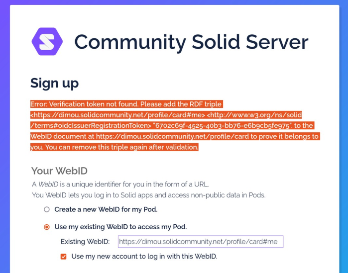
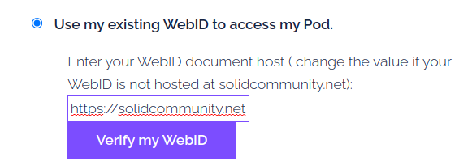
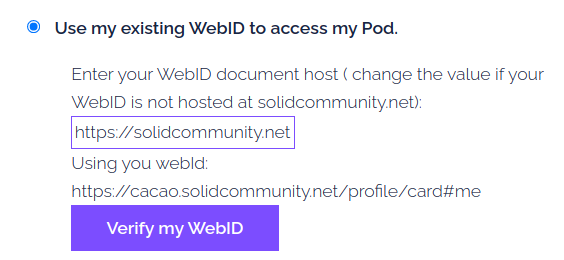
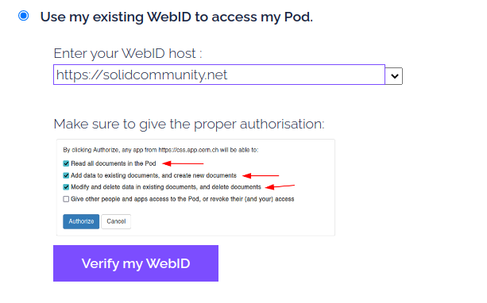
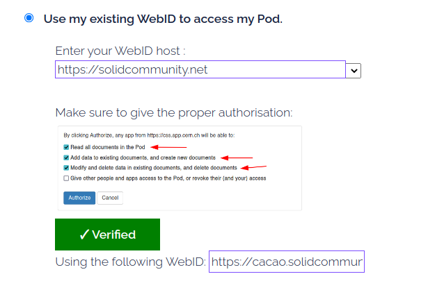
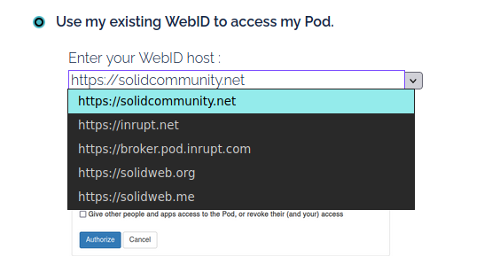

<!-- # inbox
 -> issue after test:
  - talk about pim storage
  - shoudl be a pim storage think in turtle webid
  - spec not finish on that issue, current solid app just assume pod hosted on same url as webid, but they should respect the webid claim. Issue is that expose public pod address
  - re-read the related github issue
 -->

## Problem description:

As we stated previously, SCS  is a recent software, and some of its parts - even if functioning - still lack some user-friendliness. One clear example of this statement has been experienced early in the thesis when testing the registration process.

Data storage and identities are decoupled in the solid specification; hence when a user wants to create a pod on SCS, SCS registration will offer two options:

 - create a Pod and create a new WebID as the Pod owner
 - create a Pod and set the owner to an already existing WebID

Since CERN has done previous experimental work with Solid[^indico-jan][^indico-lukas] some of CERN's users already have a WebID, mainly hosted on `https://solidcommunity.net`. Therefore, it was essential to allow those users to create an account with their existing WebID. 
<!-- TODO: check with keycloak instance: use already existing WebID or need new one?
 -->
<!--  After explaining the complexity of the default SCS registration process, we will describe the solution we design and its implementation and its tests.
 -->

<!-- {Furthermore, with the default configured SCS version, my CERN supervisor Maria Dimou was not able to create a Pod with here existing WebID}. We will, in the following, explain why this process is fastidious and how we decided to fix it {REDO too familiar}. 
 -->
For legitimate security reasons, the user wanting to create a Pod with an existing external WebID needs to prove that they are the owner of the given external WebID. Otherwise, an attacker would be able to create a Pod usurping someone else identity and un-allowing the actual owner of the WebID to create a Pod <!-- TODO verify that -->. The purpose is similar to the verification email we receive when we sign-up on a platform with our email address.

To prove that the user is the owner of the claimed external WebID, SCS asks to add a verification token to the user's WebID document. By proving that they have modification rights to the WebID document, they prove that the document belongs to them. 

When creating a Pod with an external WebID, SCS will return a `400 - BadRequestHttpError` asking the user to add a given verification token, see figure \ref{token-error} 

{width=60%}

<!-- TODO: test Maira  -->

Currently, the fastest way to add a token to a WebID document is by doing the following tasks:

   - Copy the triple with the random token given in the SCS sign-up page
   - open a new page,
   - use an external pod browser such as Penny
   - connect to their Pod through the pod browser
   - navigate their Pod to the WebID document, typically `/profile/card`
   - add given token verification triple
   - return to the sign-up page and finish the login

The former flow also makes strong assumptions that the user knows a pod browser solid app and knows how to add a triple to its WebID document
 As shown in the figure \ref{token-error}, besides being a tedious process, one needs to be well aware of concepts such as RDF tripe and pod architecture to understand the error message, which might not be the case for users with low experience with Solid.
<!-- Therefore, such a sign-up procedure in addition to being long and complicated, would also discriminate users that do not have strong skills with solid, in other words, most of the people we can expect to use how CERN based SCS instance. -->
 <!-- [Users from CERN were not able to set up the token themself, with reason.] -->

<!--  possible to remove the token
Beside local testing environment, it would be unsage to remove the token for the reason explained previously. Therefore, a new login interaction needed to be designed.  -->

## Design

To tackle the problem formerly defined, we designed a new login interaction. We stated the following principle to base our new user interaction:

 - the user should not leave the sign-up page during the sign-up process
 - the user should be able to sign-up without knowledge of RDF triple
 - the token should be added "under the hood" and the user should be able to sign-up seamlessly
 - WebID verification should not imply interactions unfamiliar to newcomers with no Solid experience.

To achieve the former goals, we made the following design proposal:

 - A button is added to the sign-up page
 - The button redirects to the user ID Provider and ask them to login
 - Once logged in, they are automatically redirected to the SCS sign-up page; even if the user has left SCS sign-up page, the automatic redirection gives a seamless experience
 - Now that we have authenticated the user, the script has the necessary authorization to write to the user's WebID document and add the verification token
 - The script adds the verification token to the user's WebID document.

In final, the user's only interaction is to click the "Verify my WebID" button and log in to their IDP.

<!-- {The user will leave the Registration page to login to their IDP, which contradicts our principle number {TODO}. However, it happens through two redirections. The first one redirects the user to the IDP. Once the user has logged in, the second one redirects the user back to the sign-up page. Therefore, we can say that it feels like the user has not left the sign-up page and give a seamless user experience.} -->
All the rest is taken care of in the background by the script. In parallel, the user can finish with their registration process. Timing-wise, by the time the user finishes the registration process, the script should be done adding the token to the WebID document.
<!-- { TODO measure time adding token } -->

<!-- {TODO should just be a button "verify my webid"} -->

## Implementation

### Description of the javascript logic

 To implement the former design, we used Inrupt's solid client browser authentification library[^solid-auth-lib] and Solid client library[^solid-client-lib]. Both are client-side javascript libraries. The first one handles the authentification to a solid pod, and the second performs basic CRUD action to a Pod once authenticated with the first library. 

Our implementation consists of 3 main functions:

 1. the login function
 1. fetch token function
 1. the add_token function

##### 1. the login

The login function relies mainly on the Inrupt authentication library. Once called, it will redirect the user to their IDP. Once the user has been authenticated on its IDP ( usually using an email/password credential, but other methods can be used), the IDP redirects the user back to the sign-up page, which now benefits from a token stored in the browser local storage. The token can be used by Inrupt's client library to edit the user WebID document with authenticated CRUD action.

##### 2. the fetch token function

The fetch function's primary goal is to get the verification token.
With the current state of SCS, the only way to get the verification token is to make a failed login attempt. After verifying that all the field of the sign-up form has been duly completed  the registration page will then check if an "oidcIssuerRegistrationToken" exist on the user WebID document. If not, and this is the case for each first sign-up attempt, SCS will return an error stipulating that a triple needs to be added to the WebID document with the token's value.
<!-- {and if SCS config is set to token verification,} -->

In other words, at the current stage of SCS, the only way to get the verification token is to fail a sign-up attempt. Therefore, two registration attempts are needed to register with a external verified WebID: a first one to get the token and a second one after the token has been added to the WebID document. 

##### 3. the add_token function

After successfully logging in and getting the verification token, the `add_token` function has everything it needs to add the verification token to the user's WebID document.

### Description of the HTML user interface
In the HTML part, we used the agile software development methodology. Therefore we went through a few iterations before achieving its final form. We first delivered a minimalistic prototype, producing short and incremental iterations. For each one, we would get face-to-face feedback with the "client" ( here, the client was represented by Maria Dimou, my CERN's supervisor ). We asked the user to test the new feature on each iteration by creating an account with an external WebID. We will describe the first and final iteration of this agile process. 

<!-- TODO: add ref agile methodologies -->
  
The first iteration consisted of two parts:
  
  1. A text input where the user can enter the host of their WebID. The default value is solidcommunity.net, as it is a popular WebID host, see figure \ref{it-1-before}.
  2. A "Verify my WebID" button: once the user clicks the button and successfully logs in to their WebID's IDP, the WebID appears above the button, see figure \ref{it-1-after}.

{width=60%}

{width=60%}

Testing this implementation with a CERN user has raised a few tickets:

  1.  The user would click the "Verify my WebID" button again after the WebID appears above the button. The arrival of a new item on the page ( see figure \ref{it-1-before} ) seems to create a new call for action for the user. More than being unnecessary to click the button twice, the script requests the verification token a second time and breaks the registration process. Therefore, a fix for this issue was critical.
  1. The user would click the wrong permission when asked for the permission scope - also marked as a critical issue.
  1. This ticket does not come from user feedback, but it seems inconvenient for users not to have their WebID hosted on solidcommunity.net to type their WebID host manually. Since this would be highly improbable for CERN users, this issue was marked with low priority. 

In the latest and current iteration, we addressed all the three issues with the following patches respectively:

 1. After the successful login to the ID Provider, the button turns green, its text change to "Verified" to signify to the user that our script did add the verification token to their WebID document, see figure \ref{it2-after-verif} . The change in color and text should indicate  that there is no more call for action.Furthermore, the button also becomes unclickable to prevent the user from clicking it twice, preventing the app from malfunctioning..
<!-- TODO REWRITE -->
2. We added a picture indicating which permission to give when the IDP asks for permission scope, see figure \ref{it2-after-verif} .
 3. We change the input text for an editable dropdown: it allows to select from a list of options or enter another one in a text field to let the users choose the host of their WebID, see figure \ref{it2_drop_down} .

We still display an input text field with the value of the WebID for convenience reasons, so the user can double-check that the WebID they are submitting to the form is indeed the correct one, see figure \ref{it2-after-verif}.

{width=60%} 

{width=60%} 

{width=60%} 

<!-- {TODO: after success, the user has proven they own the WebID, can finish fillup the registration form, and will successfully sign up with their external WebID} -->

### Component.js configuration

If we first build this new registration page by directly editing SCS' source code, we quickly decided to take advantage of components.js' dependency injection library and refactor it as an independent component. Doing so, anyone who wants to add our new sign-up page to their SCS instance has to change a few lines in their SCS config file instead of merging two code bases. We will explain how the component has been designed.
<!-- ( REDO) -->

First, we extracted all our editing files into a new folder. This folder contains five sub-folders:

  1. `components/` containing a necessary `context.jsonld` file to make our component importable to components.js library. 
  1. `src/` where we store our javascript source code. Using Webpack, all those source files will be compiled to: 
  1. `scripts/` which includes a minimized single javascript file that we will import into our HTML page.
  1. `templates/` with the alternative registration HTML page
  1. `config/` holds the `components.js` required config files that we will import from the main SCS' config file. It essentially has two things: <!-- TODO: REWRITE -->
      1. The first creates a `StaticAssetHandler` class that points to our `scripts/` folder. It will make the script accessible through an URL and therefore importable from our HTML file.
      1. The second creates a `BasicInteractionRoute` that will make SCS the `/idp/register/` endpoint to our sign-up HTML page in the `template/` folder.

Then we need to edit the root config file to import the two former defined files instead of the ones from the default configuration. 

<!-- # discution

To avoid this double sign-up, a solution could be to modify the SCS server side code to send the client a verification token during page load and not after a fail attempt to sign up. However, this would makes the footprint and the scope of our module more ~impactfull ~important. Thanksfully, SCS offer an API that allow to register a new user through POST request. Therefore, the first failled attempt required to get the token can be done {TODO under the hood} by our script without the user noticing it. Even if that solution can seems hacky, it has the advantage to keep the scope of the module to the client side and does not require to modify server side code. Therefore the former solution has been ~prefered.

 -->
[^indico-jan]:   TODO
[^indico-lukas]: TODO
[^solid-auth-lib]: TODO
[^solid-client-lib]: TODO

