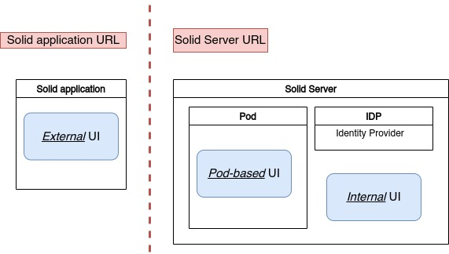

## Pod UI comparison

This section compares different UI candidates for our CERN's CSS instance. If the UI is not compatible with CSS, we will investigate the root cause of the incompatibility. Finally, we will discuss the states of CSS compatibility with UIs and the options for CERN's CSS instance. <!-- [TODO CHECK IF TRUE] -->

<!--
GRAMMARLY DONE
TODO: add click illustraion and reference in text
TODO: add corelation between deprecited app and compatibility with CSS
     -> add last commit date
TODO: solidos : not tried cause initial desire to move to another platform
TODO: metric: loc of each project
TODO: feature list -> add more critera to the tests?
TODO: which have priority: internal above pod-based
TODO: test or explain why mashlib not tested
 -->

*Definition*

A *Pod UI* ( also called an *UI* in this paper ) is a particular type of solid application strongly related to a Pod or a WebID hosted on a solid server. We expect most of its features to be related to the agent ( user or organization ) represented by the WebID or interacting with the Pod content. Examples of standard features of a solid server UI can be:

 - a Pod file browser: allow users to explore and manage all the content of a Pod: add, edit or delete files, manage ACL authorization.
 - a profile page: create and manage information about the Pod's owner's personal information and WebID ( as name, profile picture among others )
 - contact or friends list related to the WebID
 - chat and messaging: communicate with the agent represented by the WebID

*Where to host a solid server UI*

As seen in figure \ref{UiLocation} , the Pod UI can be hosted in three different locations.
<!-- TODO figure not working -->

  - As an **external app**: hosted on a different server, the UI will still be able to interact with the solid server if the user provides the correct permission upon login. Compared to the two others options, it differs strongly by being hosted on a different URL than the Pod's URL and the WebID URL.

  - As an **internal app**: by creating a recipe with a particular components.js configuration, it is possible to host a Pod UI alongside CSS . In order to do so, a new node in the dependency injection graph needs to be added to create a `DefaultUiConverter` class that shall point to the UI entry point ( usually an `index.html` file ). Currently, two recipes exist, one using Mashlib and another using Penny as a Pod UI ( those two are also available as an external app ).
 - As a **Pod-based app**. It is possible to host HTML files on a Pod and serve them with the correct content type, so they get interpreted as client-side web applications by the browser. Using Inrupt Solid client-side library, one can build a solid application and, therefore, a Pod UI. [Pod-homepage](TODO) is an example of such Pod UI.

### UI comparison

In the following, we will experiment and test different Pod UI solutions against our CERN's CSS instance. Then, we will discuss the main differences between each solution and argue which solution we choose for CERN's use.

After researcheses, we retained the following candidates:

 - oh-my-pod
 - Inrupt's PodBrowser
 - Penny
 - Pod-homepage
 <!-- - Mashlib -->

For each of the candidates, we tested:

 - CSS integration: can the UI be integrated into a CSS instance
 - Pod Browsing features: How does the UI help the user manage the content of their Pod, which includes:

   - Browse Pod's content
   - Add a document to the Pod
   - Delete a document hosted on the Pod
   - Edit a document hosted on the Pod
   - Edit `.acl`: from the UI edit `.acl` files to manage access right

 - Profile's features: How does the UI can represent the owner of the Pod, which includes:

    - Display profile: when accessing the WebID URL, the UI display a profile page with the user's information
    - Edit profile: a particular page is available in the UI to modify the user's profile information. Of course, if the UI offers the possibility to edit pod content, it should also be able to create and edit profile documents. However, in this test, we would like to see a dedicated interface where the user should not directly modify the source turtle file.

#### testing external app

In the following, we tested the 3 UIs available as external UI: Vincent Tunru's Penny UI, Inrupt's PodBrowser and Empathy's oh-my-pod. <!-- This external UI are essentially not integratable with CSS, the None Applicable ( NA ) is given by default to all the "CSS integration" criteria. --> For the "Display profile" criteria, the None Applicable value is given by default, as this is only relevant when the UI and the Solid Server are delivered under the same URL ( which is not the case for external UI ).

##### Penny 
https://penny.vincenttunru.com/

<!-- add small description about penny -->

 - CSS integration: OK
 - Browse Pod's content: OK
 - Add a document: OK 
 - Delete a document: OK 
 - Edit a document: OK
 - Edit `.acl`: OK
 - Display profile: NA
 - Edit profile: NO

##### oh-my-pod
https://ohmypod.netlify.app/

We could not log in using our WebID hosted in CERN's CSS instance. The error "WebID is not valid" is returned by oh-my-pod login page during the sign-in process, and an error `POST https://css.app.cern.ch/idp/reg 400 (Bad Request)` is prompted in the console.   <!-- ( TODO might come from legacy endpoint )
( REF https://github.com/CommunitySolidServer/CommunitySolidServer/discussions/1225 ) --> 
We found out that the issue comes from the library used for the sign-in. The library uses a depreciated username/password login only supported on NSS. More recent solid servers such as CSS and ESS use the safer sign-in based on JWT web token. Therefore, the oh-my-pod sign-in procedure needs to be updated to support JWT web-token-based authentification to be compatible with CSS. 
https://github.com/solid/solid-node-client/issues/15

We decided to bypass the error by signing in with our NSS account hosted on `solidcommunity.net` to be able to test oh-my-pod features.

<!-- TODO: in case it get fixed --> 

<!-- ##### oh-my-pod ( with solidcommunity.net )
https://ohmypod.netlify.app/
 -->
  - CSS integration: NO
  - Browse Pod's content: OK
  - Add a document: Not Working ERR: 403 forbiden 
  - Delete a document: Not available 
  - Edit a document: OK
  - Edit `.acl`: NO
  - Display profile: NA
  - Edit profile: OK

##### Inrupt's PodBrowser
https://podbrowser.inrupt.com/

Similar to oh-my-pod, we could not log in from our CSS instance. Inrupt's PodBrowser is mainly developed to work with Inrupt's Enterprise Solid Server. According to Pod Browser developers, the UI  is having trouble upgrading to the latest version of the authentification library, which causes compatibility issue with CSS [https://github.com/inrupt/pod-browser/issues/449#issuecomment-1074175962]
Nevertheless, PodBrowser is compatible with NSS, so we tried the UI with our `solidcommunity.net` account to test its features.

  - CSS integration: NO
  - Browse Pod's content: OK
  - Add a document: OK 
  - Delete a document: OK 
  - Edit a document: OK
  - Edit `.acl`: OK
  - Display profile: NA
  - Edit profile: OK

<!-- TODO mashlib
 -->
In fine, we can see that only Penny shows compatibility with our CSS instance. However, an important note is that it will split the UI and CSS-related functionality into two URLs. For example, The registration and password reset page will live under the solid server URL, whereas all the UI functionality ( Pod browsing, profile page, contact ...) will live under the external Pod UI URL. We will debate the potential consequences of this split in the discussion section. 

#### testing internal Pod UI

##### Penny 
 - CSS integration: OK
 - Browse Pod's content: OK
 - Add a document: OK 
 - Delete a document: OK 
 - Edit a document: OK
 - Edit `.acl`: OK
 - Display profile: NO
 - Edit profile: NO

Pod Browser and oh-my-pod would not work as an internal Pod UI for the reasons mentioned in the previous section. Yet, this compatibility gap might be closed in the future. For that reason, we still tried to create recipe to see if the UI could be integrated into CSS even without working. 

For Inrupt's solution, we could not build and run the standalone client-side app. The easiest way to integrate a UI to CSS is to have the UI in the form of a standalone client-side web application; this is how the Mashlib and Penny recipe are built. Then, we can use componentsjs to create a `DefaultUiConverter` class that will point to our UI web application entry point. However, PodBrowser needs to be run as a server-side application [ https://github.com/inrupt/pod-browser/issues/449#issuecomment-1075678127 ]. With compentsjs it is possible to use a server-side UI application, but such a configuration needs to be built from scratch. Of course, this work would only be worth it once the authentification compatibility issue is solved. Therefore, we did not investigate this solution further.

Similarly, we could not run oh-my-pod as a standalone client-side app, but we were able to connect to an NSS account when run as a server-side app. 

<!--  We test a recipe with penny alongside CSS. This has been
  - buggy: shared route cause of bug
  - not trivial to make one as dev: ( need to understand components.js and routing )
- talk about experimenting creation of PodBrowser recipe
- what is required to create a Pod UI
 - todo link recipe
 In this solution, the Solid Server and the Pod UI live under the same URL and this might be the source of bugs, as the two apps will share the same routing paths ( LINK GITHUB BUG).
  - even if the CSS' page and the UI are under the same URL, in contrary to external UI, they won't share the same UI, effort need to be made  -->

#### Testing Pod-based UI

Finally, we tested Pod-homepage, the only Pod-based UI we have found. Unfortunately, Pod-homepage uses a depreciated solid authentification library that does not support JWT web-token-based sign-in. Therefore, we could not test the UI as it needs to be upgraded from solid-node-client[ https://github.com/solid/solid-node-client]  to Inrupt's solid-client-authn-js [https://github.com/inrupt/solid-client-authn-js]  to be compatible with CSS.

<!--  https://gitlab.com/angelo-v/pod-homepage
https://gitlab.com/angelo-v/pod-homepage/-/issues/2
https://github.com/solid/solid-node-client/issues/15
 -->

##### Pod-homepage 

  - CSS integration: NO
  - Browse Pod's content: Partially: only shows root's files
  - Add a document: NO 
  - Delete a document: NO 
  - Edit a document: NO
  - Edit `.acl`: NO
  - Display profile: YES
  - Edit profile: NO

<!--    - pod homemade by ... not working with CSS ( only NSS ) because of authentification specification changes ( cred instead of JWT token )
 - would be easy to add a link to CSS registration page
 - every user can choose its own Pod UI
 - need to allow HTML  in Pod
   - can be a security issue if open to the world, 
     - if open to the world ( everybody can make pod -> high security risk of phishing )
    - if reserved to CERN user, depends of the trust CERN has on the user group
 - no solution exist now
 -->

### Discussion

<!-- *global status of UI, penny most suitable candidate* -->

From our tests, we can see that the majority of the UI candidates, Penny exepted, are incompatible with CSS, primarily for authentification compatibility reasons. Solid specifications are still in a magmatic state and evolving fast [https://github.com/solid/specification]. Therefore, it is not always easy for solid applications to keep up with the specification. Unlike the legacy NSS, CSS uses stronger authentification based on web token rather than username/password <!--( TODO SolidOIDC ?? )-->. Unfortunately, most of the UIs are built and tested toward NSS. Penny seems to be the most suited UI candidate for CSS, even if it only provides Pod managing features. 

<!-- *Same URL is better* -->
Contrary to external UI, Pod-based and internal UI is reachable from the same URL as the Pod URL or the WebID. Since the user will not have to remember a second URL for the UI of their Pod, we can argue that they both offer a better user experience. For example, two URLs are presented to the user after a CSS registration, the Pod URL and the WebID. We can easily assume that one of the first actions taken by the user after the registration will be to click those URLs. Therefore, we believe that it makes more sense if those URLs dereferences to a Pod UI instead of raw data.

<!-- TODO add click images and labels -->

<!-- *Pod-based live in one folder  -> one URL* -->
Pod-based and internal UIs, even if they both live under the solid server URL, still have their differences. A Pod-based UI will be accessible from the path where it is stored on the Pod. For example, if the CSS user Alice uploads a UI on her `ui` folder, the UI will only be accessible from `http://my-css-instance.net/alice/ui/index.html`, assuming that the UI is contained in an `index.html` file. Therefore it is also directly accessible from  `http://my-css-instance.net/alice/ui/`. The UI will not be accessible from, for example, `http://my-css-instance.net/alice/otherfolder/` unless we copy the UI to this folder.

<!-- *Pod-based template solution* -->
A new Pod template can be created to avoid the fastidious task of uploading the UI to each new Pod. CSS's `TemplateResourcesGenerator` class is responsible for creating the minimum required files to include in a Pod after its creation. The default behavior includes a `profile` folder containing the `card` holding the WebID and two `.acl` files in the `root` and `profile` folder. CSS also adds an unnecessary but helpful `README` file. It is possible with componentsjs to rewrite this class to point to a new template that includes our Pod-based UI. Then, each newly created Pod will, by default, include the UI.

<!--TODO: add link to CERN profile viewer-->

<!-- - two UI solution made by developers
- for profile use case, same URL better
   - assume that is can be intuitive for user to find the Pod UI on the same URL as their WebID or Pod URL ( profile page on WebID URL like solidOS)
 - Pod-based solution has interesting advantages, such as allowing each user to have their own UI, but need to allow interpret which can be a security issue as explained ./2_security.dr.MD
Complicated when Pod decoupled from WebID: how  thing should be interpreted and show explained to the user? profile_viewer should show the `maker` website or not?
see ./2_UI.dr.md
 -->

### Decision 

Penny is arguably the most suited candidate for UI integration to CERN's CSS instance, even if it only offers Pod management features. The last question remains whether it should be integrated to CSS as an internal UI or an external UI. 
We choose not to integrate it as an internal UI for our CSS instance. Using a UI as an external app has the substantial inconvenience of splitting the usage of the Solid Server into two different URLs; therefore, it might not be the optimal solution in terms of User Experience. However, we thought that UIs are not yet well developed for CSS, and it would be too soon to settle with one. Therefore, it seems most valuable to leave the space empty if new UIs get developed that suit CERN's needs or the current incompatible ones get upgraded or if CERN decides to develop its own UI.

<!-- TODO REWRITE LST SENTENCE
 --><!-- TODO? talk about penny not totally working as internal app -->
<!--TODO ADD transition to profile viewer -->

