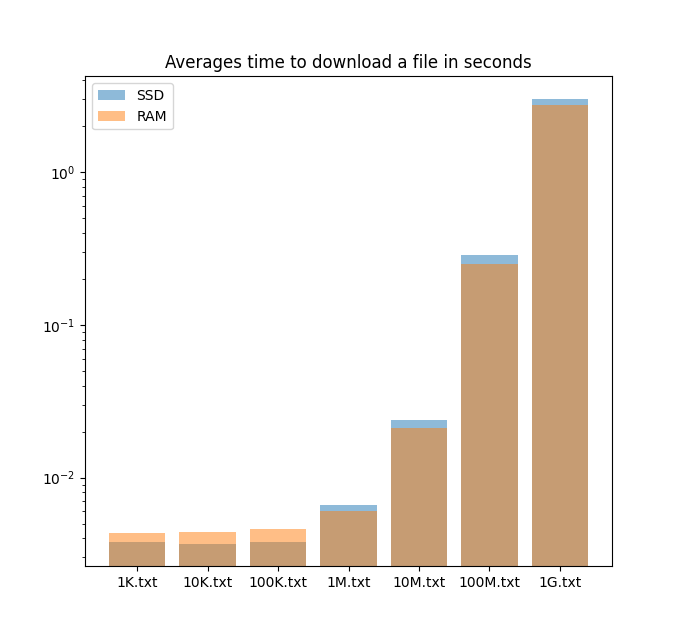
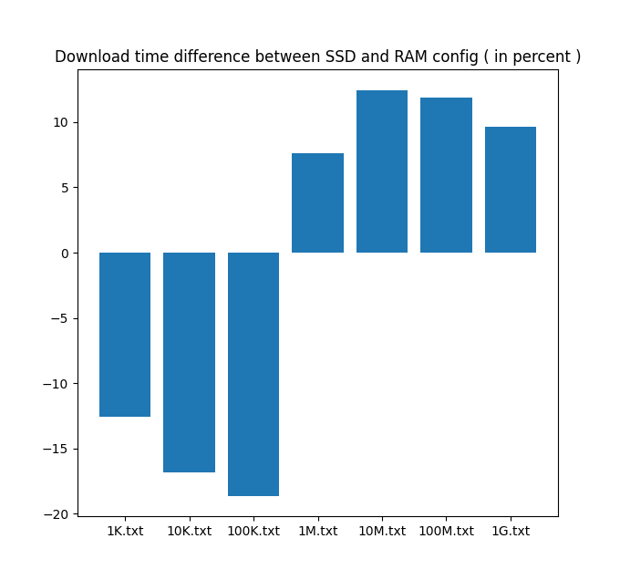

<!-- test localhost to avoid internet conecction noise -->
<!-- TODO test at CERN -->

##  File storage

In this part, we will discuss the possible option to store data with CSS, and after a few tests, we will explain why we choose to store data as files. 

Currently, CSS allows two options from user data storage:

  - RAM-based
  - file-based

Two aspects of storage are particularly relevant for us: how do the different options affect performance, and how sensitive information, such as passwords, are stored.<!--  After studying the two options and doing performance tests, we will argue why we choose to store user data as files for CERN's recipe.  -->

 If the CSS instance's machine shuts down, all user data will be lost with RAM storage configuration. Naturally, file storage was the preferred choice as it permits saving user data in a persistent external volume that can be mounted to CSS's host machine. Other benefits, such as the use of an external persistent volume are explained in the DevOps chapter. <!-- [TODO add link to chapter] -->
<!-- TODO expend PV benefice
 -->
With file-based data storage, CSS will store authentification data as a file, but sensitive data such as passwords will be hashed with the bcrypt algorithm [ref code]. Bcrypt is a robust hashing algorithm derived from Bruce Schneier's Blowfish, built to resist brute-forcing and rainbow tables attacks; the two primary attacks again hashed password[^bcryptWeb] . Other files are stored unencrypted. Therefore, anyone having access to the server ( either the official sysadmin or a potential hacker ) will have clear access to file content, even if the ACL permission file restricted the access to specific authorized users. Options to encrypt all user data files have been evoked but are not yet implemented. [ref github issue]

Amazon has realized that reducing its loading page by 100ms would result in a 1% sales increase[^amazon]. This example shows how speed performance is of paramount importance for users' engagement in web applications. Therefore, measuring any performance differences between RAM and files-based storage seems relevant. Therefore, we ran a test to compare performances between both options to verify if one of them would represent a considerable disadvantage. 

<!-- *Hypothesis*
 -->
Our first hypothesis is that RAM storage should be faster than file-based storage. <!-- TODO depend harddrive --> We would also like to measure how much each option impacts speed performance.
<!-- TODO But that depends on the material, specialy SSD HDD -->

<!-- *Method*
 -->
To test our hypothesis, we created different recipes. The first one stores user data in RAM, and a second one stores user data on the hard drive filesystem. <!-- (TODO THREE?) + add ref to the recipe--> To protect the test from internet connection fluctuations, we decided to run the test on a local machine. <!-- TODO Also CERN use shared ressources -->

To see if the size of the file would impact performance, we generate a set of text files of randomly generated characters, ranging from approximately 1 kB to 1 GB. We generate them with the following bash script:

```bash
# Example generating a ~ 1 kB files of random character
tr -dc "A-Za-z0-9\n\r" < /dev/urandom | head -c 1000 > 1K.txt
```

Then we store those files in a `data` directory. We create a new Pod on each of our recipes and upload the files folder in each. For that purpose, we used Penny for our RAM-based recipe, and we copy-pasted the `data` folder inside the Pod for the files-based recipe. <!-- THREE -->

In order to not get an authorization error when trying to reach the file from our script, we need to change the `.acl` file in the root of each Pod to permit the public ( therefore our script ) to access all Pod contained files. We must change the Pod's root `.acl` file for that purpose. More precisely, the `public` subject needs to use the `acl:default` predicate ( which gives access to the subject to the predicate folder and subfolder ) instead of the `acl:accessTo` ( which only give the subject access to the object file ). The object remains the same ( `<./>` ), which represents the current folder ( in our case, the root folder ). Therefore, The `public` subject should be defined like so in the Pod's root folder:

```
<#public>
    a acl:Authorization;
    acl:agentClass foaf:Agent;
    acl:default <./>;
    acl:mode acl:Read.
```

  *We changed on line 4 `acl:accessTo <./>;` to `acl:default <./>;`*

Finally, we use a python script to fetch each file for each recipe. The python script will iterate through each Pod configuration, and for each config, the script will try to download all files ranging from 1kB to 1G. To get a more robust result,  we repeat each download an undread time and take the average download time.


*Results*

{width=50%}
{width=50%}

As we can see, files under 1mB have more or less the same average download speed. We believe those results are biased by the constant time taken by CSS to process the file, and at that point, the size of the file is nugatory compared to the processing time. Interestingly, we can see that RAM-based storage gives poorer results with files under 1mB; we could not find the root cause of the phenomenon. Otherwise, RAM-based storage confirmed our hypothesis and showed better performance for files above 1mB. RAM seems to be 13% faster on average than file-based storage (with a standard deviation of 2 points of percentage). The downloading speed difference does not increase or decrease as the files grow in size.

<!-- TODO redo test, get difference time
 -->

*Discussion*

For current CERN's use case, performance is not yet a priority. Therefore, using file-based storage seems more advantageous than the performance gained with RAM-based storage. Nevertheless, it is valuable to know that downloading speed can be improved on this level. In such a case,  it would be essential to consider regular backups of the memory state to avoid any data loss if the host machine shuts down.

Furthermore, even if CSS author stated that it is developed for experimental purposes only[^cssReadme], is it important to notice that their use up to date, secure hashing algorithm for passwords, which will provide state of the art protection in case of data leak ( 2nd recommended hashing algorithm by the web security OWASP organization [https://cheatsheetseries.owasp.org/cheatsheets/Password_Storage_Cheat_Sheet.html] )


<!--
  TODO test with at CERN
  TODO: From HHD we see that XXX slower than SSD, depends on harddrive
  TODO: ask Michal which infrastructure they have
  TODO performance test between file storage and RAM ( also HDD vs SDD )
  TODO test on alien
 -->


<!-- RAM more expensive + no much storage space + delete file if shutdown 
SSD persistent storage but slower
RAM: choice for small file with no loss risk
SSD: good for CERN -->

<!-- [^bcryptWeb]: http://citeseerx.ist.psu.edu/viewdoc/download?doi=10.1.1.1072.20&rep=rep1&type=pdf
[^amazon]:  https://www.researchgate.net/publication/220475549_Online_Experiments_Lessons_Learned/citation/download
 -->
[^cernStorageType]: https://clouddocs.web.cern.ch/file_shares/share_types.html

