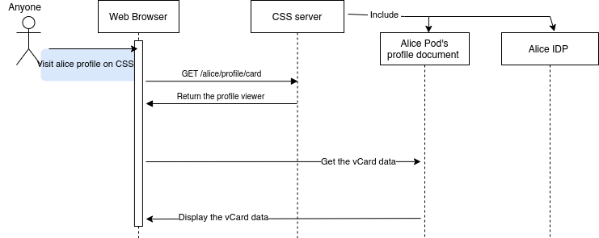
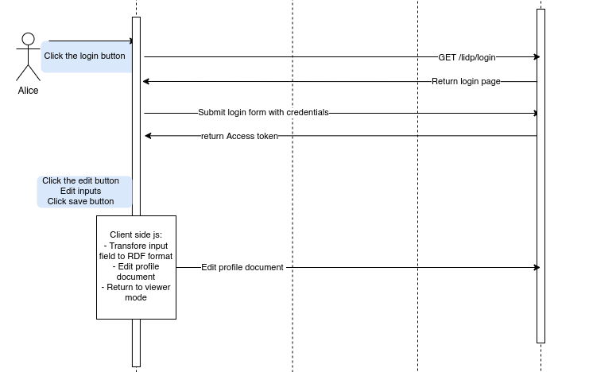
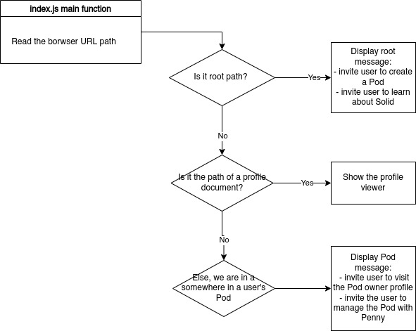
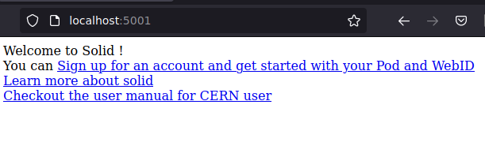
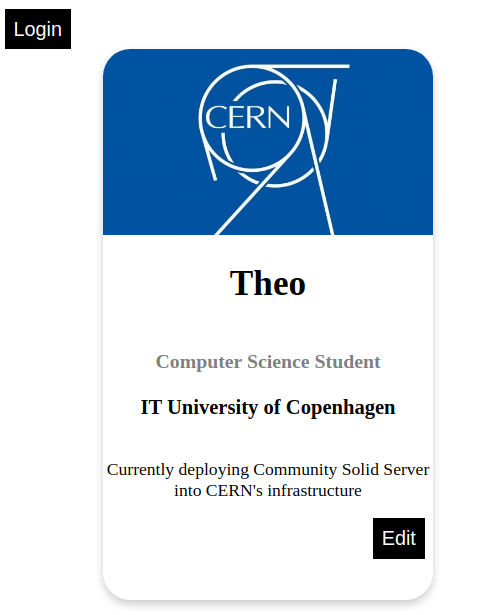
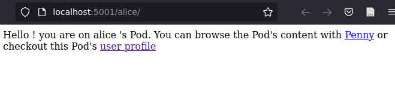

## Profile viewer component

### Motivation

The previous chapter on UI comparison  <!-- TODO link
 --> shows that no compatible UI has a profile viewer feature. Previous profile viewers/editors have been built in the past, but most of them are outdated. Previous chapters also show that with the quick evolution of Solid specification, outdated applications have a low chance to be compatible with CSS. Therefore we decided to build our own profile viewer and integrate it into the CSS UI. Furthermore, if CERN decides to build its UI in the future, this app could be a starting point, as it will provide the basic building block, such as login, routing, and CRUD actions to bootstrap a UI.
 <!-- internal, pod based? -->


VCard is a particular RDF vocabulary that represents various information about an agent ( individual or organization )[https://datatracker.ietf.org/doc/html/rfc6350]. It holds common property such as name, role, address, mail, phone number. Our profile viewer will display a few vCard attributes of an agent.


 <!--  - CERN needed UI display profile
 - no compatible UI have this feature ( as shown prev ) 
   - recipe only penny mashlib ( podbrowser but no profile )
 - existing profile viewer/editor not working depreciated
 - decided to create a pod viewer ourself
 - also pedago tools for different UI, regarding choice of CERN in future, good place to start, compare available solution
   - give basic building block for a CERN UI: CRUD action
   - internal, external, Pod Based
 -->


### Architectural Analysis and Synthesis

#### System description

 The system goal is to display vCard information from a WebID or a profile document. An *editor* mode can be activated to edit and update the vCard information on the Pod data with new values. Once the values are updated, the system returns to the *viewer* mode and displays the edited values.

#### Features

The component has the following functionalities:


 1. On a profile document URL ( `/profile/card` ) a user can see the vCard information of the corresponding profile
 1. A user can sign in with their Solid IDP
 1. If the user is logged in and has permission to edit the profile, they can edit the vCard values.
 
  - `fn`: the full name of the agent holding the WebID document
  - `organization-name`: to which organization the agent is attached to
  - `role`: what is the role of the agent in the organization
  - `notes`: arbitrary text the agent can display, usually a short description of their activity 

Finally, the UI has a primary routing feature that displays different representations depending on the URL path, see figure \ref{profileViewerRoutingFlow}.

#### Type of Users

They are two types of users: the viewer, who read the vCard information, and the owner(s) of the profile document, which has the right to edit it. By default, the profile owner has the proper permission from the WAC to edit their profile document. However, this can be abstracted to a larger group of users with the `WRITE` permission on the profile document. For example, if the profile represents an organization and not an individual, a group of users from this organization( eg. the administrator ) could have the right to edit the organization profile.

### Design


We decided to implement this component with the least fioriture possible. Therefore, we build this component without any javascript or Cascading Style Sheet framework. The profile viewer should be displayed only when the URL matches a profile document URL ( ending with `profile/card` ). Other URLs should also be handled, but they are not the central focus of this component. If the URL does not match a profile document, a minimalistic message should be displayed to guide the user toward the possible actions. The component focuses on the primary CRUD action and Solid interaction, with less noise possible. Only the core logic elements are developed, so they can be easily extended to a framework of one's choice.<!-- TODO routing -->

The UI does not have any Pod management feature and should rely on Penny ( used as an external app ) to do such tasks. 

<!-- TODO #### Context diagram -->

#### Sequence diagram
\
&nbsp;  
\

\

\

### Implementation


The component is implemented as a client-side javascript application to be integrated into CSS. It consists of one HTML, one javascript, and one Cascading Style Sheet file. 

The app starts with the routing behavior to mimic the routing feature common to javascript frameworks. Then, based on the path of the current document URL, the app will display different representations, as shown in the flow chart \ref{profileViewerRoutingFlow}:
  
\
{width=100% margin=auto }
\
  
 - On the root path, i.e., the index page of our CSS instance: we return a page that invites the user to create a new Pod, learn about solid, or read a user-manual made for CERN's user.
  
\

\
  
 - On a user profile document path ( `/<pod_name>/profile/card#me` ):  we return our profile viewer, which will show the vCard information of the owner of `<pod_name>`, the main focus of this component.
  
\
{width=50%}
{width=50%}
\
  
 - Otherwise, if we are not in the root path nor the profile document path, we are in the path of a Pod. Unfortunately, our app does not have any Pod browser feature, so we invite the user to explore their Pod with Penny, used as an external app.
   
\

\
  


VCard elements are commonly readable by the public, but authorization is usually needed to edit them. Therefore, the profile viewer has two modes: the viewer mode, which displays the vCard information, and the editor mode. Editor mode needs a login and changes all the vCard elements into input fields, allowing users to edit them. A button `Save` also appears; saving will edit the profile document with the input value and return to the viewer mode. 

We submitted feature requests to prefill the OIDC issuer from Penny URL to facilitate the transition from the UI to Penny [https://gitlab.com/vincenttunru/penny/-/issues/20#note_880905992]. The feature request got accepted, and the OIDC issuer can be prefilled with CERN's CSS instance. Therefore, our link to Penny will have the following form:

```html
<a href='https://penny.vincenttunru.com/?solid_server=${basenameUrl}'>
Penny</a>
```

With `basenameUrl` being defined by:
```javascript
const basenameUrl = 'https://' + document.location.hostname
```
The prefilled OIDC issuer filed will give a more seamless experience to the user, as they will not have to enter the URL of CERN's CSS instance when landing on Penny's page.

#### Integration to CSS

 To integrate the profile viewer into the CSS configuration, we first need to remove CSS' default minimalistic UI. Starting from CSS' default configuration file, we remove the creation of the original node that initiates the class `urn:solid-server:default:DefaultUiConverter` and create a new node in the dependency injection graph:


*`config-profile-viewer.json` graph*
```javascript
  "@graph": [
    {
      "comment": "Serve custom CERN profile viewer as default UI representation",
      "@id": "urn:solid-server:default:DefaultUiConverter",
      "@type": "ConstantConverter",
      "contentType": "text/html",
      "filePath": "./profile_viewer/dist/index.html",
      "options_container": true,
      "options_document": true,
      "options_minQuality": 1
    }
... other DI graph nodes
```

CSS will now serve our UI upon `text/html` request if the route does not point to a CSS page ( such as the registration page at `/idp/register/` ) or an HTML document hosted on a Pod,  meaning that Pod-based UI are still possible. We set both `options_container` and `options_document` so the UI is returned for container URL ( ending with a slash `/` ) and non-container URL ( ending without a slash ). The `minQuality` referer to the quality rules defined by RFC 7231 [https://www.rfc-editor.org/rfc/rfc7231#section-5.3.1] is a weight ranging from 0.001 to 1 ( 1 being the most preferred), defining the quality of the representation. It is an HTTP standard to discriminate representation when a resource has multiple representations. The most important one is the `filePath` property, pointing to the profile viewer static files we build, hosted in the root directory under the `profile_viewer/dist` folders.  


<!--
   - can test performance, with less noise as possible from  js or CSS framework
   - restrict to the minimum in order to be easily readable and editable
 -
 - if the webid not hosted on the pod, not display webid but link to the original webid
   - ??? only for internal and pod based??

The components is stored in the root directory of the recipe.
Design choice? -> put it in NPM module 

### Discussion
### limitation 

 - need to be compiled with webpack ( inrupt library requirement )
 - fetch vcard data from webid
 - maker of the pod and not the webid included in the pod
 - usefull in case the pod is created with an external WebID
 - display vcard info
 - edit vcard info


### test
### we used lighthoue to create test
  - explain pod vs internal
  - explain different pods a c,d
    - a: self webid + pod
    - c: cacao webid ( empty)
    - d: dimou webid ( full profile )
  - explain metrics speed, first loaded, biggest loaded
  - check browser of much time each action

### discution
 podbased vs internal no differences between too
 - podbased: does serve every URL
 -->


