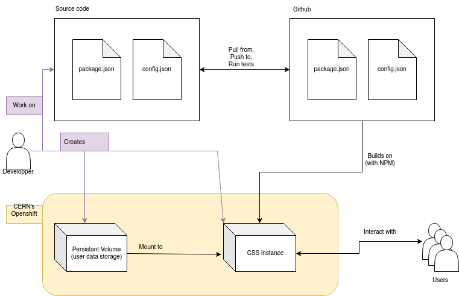

<!-- TODO: routing sec. issue:
 - one open VM for experimenting, connected to a PV with only test user. - one close VM for CERN users.
 - TODO : how to test recipe again solid test suite
## Infrastructure setup
*descripe the infra setup, argue for the choices, how to reproduce*
 -->


## DevOps


*Setup description*



As seen in figure \ref{devopsDiagram}, the global architecture for the DevOps consists of 3 main entities:

 - the source code, where the developer(s) can edit CERN's CSS recipe
 - the remote repository, where the source code is published, reviewed and edited by other coders
<!-- where the developper(s)  the modification get tested again the Solid Test suite ( TODO investigate) through github action. -->
<!--  -   The CERN's official documentation ( ADD REF ) recommend the use of CERN's gitlab instance to host the remote to host the remote source code repository. Since the tests suite is already setup for through github actions ( CSS main repository is hosted on github ) we decided to keep our repo on github, to benefite from the already setup automated testing. To keep into consideration CERN's recomandation, a clone of the repo is available at CERN's gitlab instance ( ADD REF ). -->
 - the server in itself, hosted inside CERN's Openshift infrastructure, is built of two virtual machines (VM):
   - The App VM: serving the CSS instance, this VM leverage Openshift CI/CD to automatically build our CSS recipe from a git repository. If the repository contains a `package.json` file, Openshift is smart enough to understand that it has to build an NPM package. Therefore, it will first try to build the package with the default command `npm build`. Once the package is built, it will try to run the package with the default command `npm run`. The former can be edited through the global variable `NPM_RUN`, which we can set when starting the VM build. In our case, we do need to modify use `NPM_RUN` to set the server correctly:

      - we set up the running port 8080 to match the Openshift configuration:
      - we set up the path where CSS should store users' data which is the path where we mount the persistent volume for user data ( see next section )
      - we set up the basename. For Cross-Origin Resource Sharing reasons and to display links with the server's full URL correctly, CSS needs to know on what is the base name of our server URL 
<!--    ( - we setup the path of the given configuration TODO: explain that can have multple config )
 TODO: remove `-c myconfig.json` from package.json and put it in the NPM script 
 -->
   - Persistent Volume ( PV ): this VM acts as a simple file system that can be mounted to other VMs; it is where our CSS recipe stores users' data. Such a VM should be built only once, as rebuilding it would erase users' data. A good improvement would be to apply backup regularly to prevent any data loss. Since the goal of this thesis is mainly experimental, it has not been judged necessary to deploy any backup process.  
<!--    REMOVE?: Since this operation should be done only once, no scripting as been ...
TODO:
 --> 

The choice of separating data and application has a few benefices. The main one is that it allows the creation and experimentation of different recipes hosted on different VM. Then, the persistent volume can be attached to a new application from the Openshift interface. It allows testing the application in the hosted environment ( instead of locally ) before publishing it to end-users. Secondly, we were not able to create a script to update a recipe within an App VM; whereas rebuilding the whole application can be done with a few lines of bash script, see the following listing<!-- TODO add ref-->. In addition, it permits rolling back to a previous build from the Openshift platform.

*Bash script to deploy a CSS recipe to openshift from a git repository*
<!-- ```{#lst:captionAttr .bash .numberLines  caption="Bash script to deploy a CSS recipe to openshift from a git repository" label="my_sec"}
 -->
```bash
# Fill the following variables

APP_NAME=""
PROJECT_NAME=""
GIT_REPO=""
# path where the PV is mounted on openshift
DATA_STORAGE_PATH=""
# required but does not need to be meaningfull
PROJECT_DESC="$PROJECT_NAME"
# default openshift URL 
BASE_NAME="https://${APP_NAME}-${PROJECT_NAME}.app.cern.ch"

echo "remember to run sshuttle and login with oc"

# comment/uncomment the desired options:
# Create an app in a new project...
oc new-project "$PROJECT_NAME" \
  --description "$PROJECT_DESC"

# ... or form an existing one
# oc project $PROJECT_NAME

oc new-app "$GIT_REPO" \
  --name "$APP_NAME"

oc create route edge \
  --service=$APP_NAME \
  --insecure-policy='Redirect' \
  --port=8080

oc annotate route $APP_NAME \
  --overwrite haproxy.router.openshift.io/ip_whitelist=''

oc start-build $APP_NAME \
  --env=NPM_RUN="start -- -p 8080 -b $BASE_NAME \
    -f $DATA_STORAGE_PATH"
```


