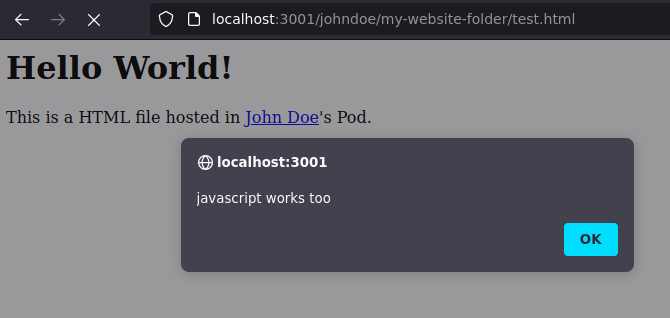

# Phishing risk of Pod hosting HTML files

The main goal of this thesis has never been to make an exhaustive security audit of the Community Solid Server. Nevertheless, our close work on CSS mechanisms has naturally led us to investigate the security aspect of some of its interactions. In particular, we tested how CSS could be prone to phishing attacks by using a fake look-alike login and registration webpage hosted on a trustable URL.

*Context*

A CSS Pod allows users to store files, particularly HTML files. If these files are publicly available through the ACL, CSS will serve them with the appropriate `content-type` header, making the browser interpret them not as text files but as client-side web applications, see figure \ref{PodWebAppExample}. Unfortunately, if this feature allows users to host their website on their Pod, it can also have a negative counterpart if used with evil intention.

<!-- TODO: add url to webpage is Podurl+pathtofile-->




*Method*


As with any classic phishing attack, the following scenario does not require any advanced technical skills, apart from being able to clone a webpage. In the following scenario, Eve will try to steal  Alice's credentials. First, Eve will clone our CSS instance's original and legitimate login or registration web page. Then, edit its source code to change the behavior of the form: instead of submitting the form's data to CSS's API endpoint, the form will send them to a malicious server that will log and steal the credentials. Optionally, the phishing page can redirect the user to the original web page after submitting the form to make the attack more credible.

In a second time, Eve will create a new account and carefully choose the Pod name of that new account, as it will appear in the URL of the hosted webpage. In our case, we choose to call the Pod `password`. Then, Eve will host the fake registration page on the root of here Pod and change the ACL to make the page accessible to the public. Now, Eve should have hosted a login form at: `https://my-css-instance.net/password`

Finally, assuming that Eve has access to a chat or users' email addresses, it would be possible to send a highly credible phishing message that brings users to the un-legitimate page. 

<!-- see figure \label{LabelName}
 -->

*Tests*

 Testing this attack with CSS gives us good results. CSS does not have a banlist for username. Therefore,  we could create accounts with any arbitrary string such as `password`, `account` and others.

 Moreover, we were able to create accounts close to the `idp` keyword. `idp` is in front of the URL path of the login and the registration page ( `/idp/registration/` and `/idp/login/` ). We used different variation techniques such as homoglyph ( replacing a letter with a similar one: `idp` to `ldp` ) and transposition ( swaps two letters: `idp` to `ipd` ). By creating a `register` and `login` folder in the Pod named `ipd`; and then hosting an evil registration page on an `index.html` file, we were able to host a webpage under the URL `http://my-css-instance.net/ipd/register/` instead of the official `http://my-css-instance.net/idp/register/` ( the only difference is the permutation of the `p` and `d` in the `idp` part of the URL ).

<!--  Still possible with subfolder name -->


For comparison purposes, we tried the same attack on the `solidcommunity.net` NSS server. We realized the NSS is using a banlist, and we could not create a Pod named `password`. However, due to the open-source nature of `solidcommunity.net`, we could find the original banlist [^banlistNss]. Therefore it was easier for us to find a Pod name that would pass the banlist verification, and we ended up creating a Pod named `password-recovery.`

We also confronted CSS to homograph attack - a kind of homoglyph attack known as Visual Spoofing Attack. Homographs appeared after switching from ASCII to the utf-8 character set. The goal is to replace a string of Latin characters by using a similar letter from a non-Latin alphabet. For example, the Cyrillic letter `e` looks identical to the Latin letter `e`[^homographAttack]. However, CSS replaces non-Latin characters with a minus character ( `-` ). Consequently, CSS is not prone to visual spoofing attacks. 

*Discution*

The consequent security impact is highly relative to whom the app is exposed. If the CERN's CSS instance is only available inside CERN's network and accessible to users who have VPN access to the network, it will not be as high as if the application is exposed to the whole world. When deploying an application to CERN's openshift platform, it will - by default - restrict its access to CERN's network. Assuming that all CERN's users can be considered trusted used, deploying a CSS instance on CERN's openshift platform should not compromise CERN's security. <!-- [TODO add ref already allowed to created website] -->

However, CERN's openshift platform allows exposing the instance publicly. It can be done by replacing the application router's `ip_whitelist` with an empty string. An easy way of doing so is by adding the following line in our script in the DevOps chapter <!-- [TODO add ref] -->, before the `oc start-build` command.

<!-- [@lst:my_sec] -->
<!-- ~~~{#lst:captionAttr .bash  caption="Removing CERN's IP whitelist restriction" label="my_sec"}

*Removing CERN's IP whitelist restriction*

~~~bash
--> oc annotate route $APP_NAME \
  --overwrite haproxy.router.openshift.io/ip_whitelist=''
~~~


 Then, we allow anyone to host a web page, therefore spoofing the CSS web page and any of CERN's registration/login pages under the `cern.ch` domain name and TLS certificate. In that case, the security risk should be taken seriously. In the following, we will discuss three potential solutions. From the most secure solution to the less secure:

  1. Do not allow CSS to serve webpage.

The most radical solution is to disable the rendering of web pages from CSS. Is it possible with components.js to create a `ContentTypeReplacer` class that replaces all response with the `text/html` content-type to `text/plain`. However, this would break the rendering of potential internal UIs and Pod-based UI, as they would be returned as plain text. According to CSS developers, making the content-type converter work alongside an internal UI is possible, but it would require advanced configuration ( by creating a `WaterfallHandler` class that can contain the original UI converter and the content type replacer ). [^contentTypeIssue]

  2. Do not allow users to choose their Pod name

A less restrictive solution would be to create all users with defined username, Pod name and a temporary password. It can be automated using CSS API with the following request. 

<!-- ```{#lst:captionAttr .bash caption="Create a new user from CSS' API" label="my_sec"}
 -->

*Create a new user from CSS' API* 

```bash
 curl -i  -H "Accept: application/json"
          -H "Content-Type: application/json"
          -X POST
          -d `{"email": "johndoe@mail.net",
               "password": "s3cr3t",
               "confirmPassword": "s3cr3t",
               "podName": "johndoe",
               "register": "on",
               "createWebId": "on",
               "createPod": "on"}`
          http://my-css-instance.net/idp/register/

```

   This solution still allows users to host their webpage but it allows the sysadmin to control the creation of new accounts. Plus, it will not allow them to create misleading URLs.

  3. Create a banlist for Pod names

   A strong banlist can prevent - but not avoid - creating a misleading Pod name. Nonetheless, as we have seen with the `solidcommunity.net` example, banlists have their limit. As mentioned above, users will still be able to host their webpage.

<!--    Black list proposal, just put link or  --> 

<!--  4. Use another URL base
 A solution that can only be implemented upstream, but the use of a second URL base from interpreted Pod content ( such as Github and github.io ) -->


<!-- DOS  register page -->
<!-- No security audits yet -->

*Conclusion*

 This section confirms the intention of CSS authors[^CSSReadme]: CSS is built in priority for experimental purposes and does not come with highly secure default configurations. However, this investigation shows that thanks to components.js and CSS' high modular capability, a solution can be easily implemented to tackle security issues. Finding one security issue in CSS default configuration does not imply that CSS is insecure by essence but only by its default configuration. Work still needs to be done to build a hardened-secure configuration<!-- [ TODO REWRITE] -->. It does not seem unlikely that a secure-hardened CSS recipe will appear in the future. Until then, it is recommended for CERN to use CSS for its current purpose: experimentation; and the future Solid developer at CERN should consider particular attention to whom the application is exposed to and what data is hosted on the Pods.

<!--  TODO: OK for CERN profile
 -->

[^homographAttack]: https://www.researchgate.net/publication/220420915_The_Homograph_Attack

[^unicodeSec]: https://unicode.org/reports/tr36/tr36-8.html#visual_spoofing

[^banlistNss]: https://github.com/marteinn/The-Big-Username-Blocklist/blob/main/list_raw.txt

[^contentTypeIssue]:  https://github.com/CommunitySolidServer/CommunitySolidServer/issues/1226


