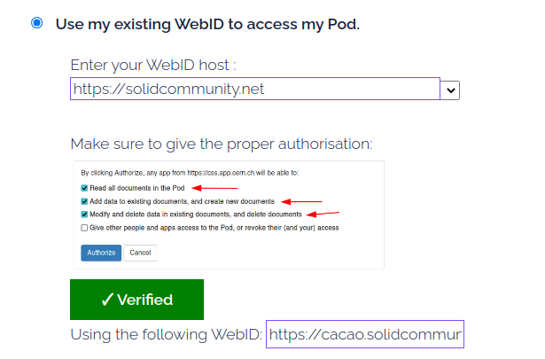
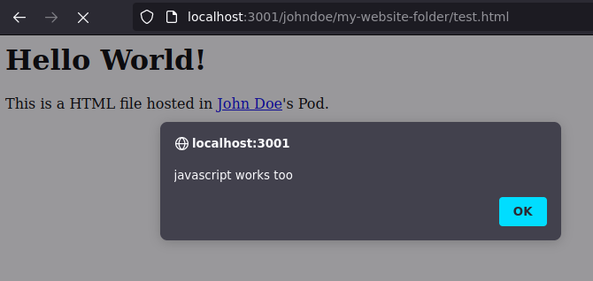

Abstract
========

Solid, for **So**cial **Li**nked **D**ata, is a project aiming to give data sovereignty back to internet users by radically changing how we use web applications. Developed by the inventor of the World Wide Web, Sir Tim Berners-Lee, it aims to decouple web applications from data. In a Solid environment, users own a Personal Online Datastore (Pod) and consume zero data applications. The zero data application is connected to the user's Pod and reads and writes data on the user Pod instead of its database.

CERN, the birthplace of the Web, is interested in Solid and has defined a project to investigate how Solid could be used inside CERN's infrastructure. In particular, CERN shows interest in deploying its Solid server. A Solid server's goal is mainly to server Pods and authentification through an Identity Provider ( IDP ). Community Solid Server, released in August 2021, is one of the first open-source Solid servers that implement the Solid specification [css readme]. 

The central goal of this thesis is to investigate SCS as a solution for CERN's Solid server needs. SCS being a highly modular software, we created a custom configuration for CERN and argued upon the choices taken. In particular, we crafted two new components: an alternative, more user-friendly registration page, and a user profile viewer. Finally, we deployed the result to CERN's infrastructure. As part of the investigation, we also tested if we could integrate SCS with CERN's Single Sign-On. Furthermore, as SCS comes with a minimalistic UI, we also tested to integrate different UI. Based on these experiences, we finally reviewed the software based on the ISO25010 quality software standard. 

The investigation concludes that even if CSS, and mostly its ecosystem, lack maturity,  CSS is a software of high quality, with remarkable plasticity and a viable solution for CERN to a certain discussed extent. 


# Context and terminology

In this chapter, we will describe the principal elements needed to understand the context and motivation of this thesis. First, we will go through a quick recall of the history of the web and its current challenges. Then we will talk about the motivation behind Solid and describe its main components. 


### History and current state of the World Wide Web

In the 1980s, the  European Organization for Nuclear Research, also known as CERN, was looking for a way to make physicists easily share their work and data around the globe. Internet was at its beginning, the TCP/IP protocol was freshly invented, but at this time, sharing data across multiple computers was laborious and inefficient[^web30bd]. A layer was lacking to write, transmit and store information easily through the network.
In 1989, Sir Tim Bernes Lee submitted a proposal for an information management system to tackle the former issue with new concepts such as hypertext links, web browsers, the HTML language, and the HTTP protocol[^vox-www] [^w3-web-proposal].

<!-- {width=50%}-->

On 1991 August 6, the first website available on the world wide web, "http://info.cern.ch" was born. 

<!-- { width=50% } -->

Today's web might be far from the decentralized digital utopia imagined by Sir Tim Berners Lee in the early 90s. Currently, most services, data, and patents related to web technologies belong to only a few companies, commonly referred to as GAFAM[^centralised-web-article]. This oligopoly is in part due to a phenomenon called the "vendor lock-in": users tend to stay with the same platform since it is too hard to switch to another one <!-- [lukas p1] -->. Furthermore, The centralization of web services and data has been a the heart of the latest internet scandal such as Cambridge Analytica or the worldwide NSA information gathering revealed by Edward Snowden[^guardian-dweb].

<!--  - 
 - privacy issue: 2013 leak from Edward Snowden has shown that with backdoors to a few companies, the US government could spy on a large part of the world population.
 -->

### Solid: Tim Berners-Lee proposal to Re-Decentralise the web

To tackle those problems, Tim Berners-Lee has started the Solid project in 2016 as a mean to re-decentralize the web[^solid-wikip]. Solid take advantage of the Semantic Web (also known as Web 3.0 but not to be confused with web3), a new set of standards extending the current World Wide Web to make the internet's data machine-readable. It is made machine-readable through Linked Data, a new way of formatting structured data to ensure its integration, interpolation,  and interpretation by machines in the Semantic Web. Solid - sometimes stylized SoLiD - stands for **So**cial **Li**nked **D**ata. It aims to give back data control to internet users and improve their privacy online. Solid is not a technology in itself, but rather a set of specifications that allows decoupling of web applications' authentification, data, and app logic[^solid-spec-protocol] . The end goal is to give internet users complete control over their data[^solid-wikip] . However, the web needs a couple of new artifacts and vocabulary to allow this decoupling; the two most important are the Pod (decoupling data storage) and the Identity Provider (decoupling authentification).

A Pod (Personal Online Datastore) is where Solid users store their data online. Like a Unix filesystem, the WAC (Web Access Control) controls who can read, write or delete files stored in a Pod. Each of these permissions is defined in `.acl` "Access Control List" files[^solid-wikip].

WebIDs are the standardization of a universal identifier used for authentification. More than replacing the traditional username, it is a full URI that, once dereferenced, can give more information on the end end user. It usually has the form of:
`https://my-webid-host.net/my-username/profile/card#me`
. The Identity Provider (IDP) permits the user to login into various applications with their WebID in the fashion of today's "Sign in with Google/Facebook". It uses The Solid-OIDC protocol - built on top of the Open ID Connect - that manages authentification in a Solid environment.

 Identity Provider and Pod Provider are two decoupled services, but a Solid Server usually serves both. 

Let us illustrate all those new terms with an example:
Alice has a pod hosted on `http://alice.pod.org` where she stores her data, including a holiday picture at `http://alice.pod.org/picture/holiday.png`. By associating the `READ` permission to Bob's WebID  `https://bob.anotherpod.org/profile/card#me` in the ACL file `http://alice.pod.org/picture/holiday.acl`, now Bob, if authenticated with his WebID will be authorized to access the picture at `http://alice.pod.org/picture/holiday.png`.

Those specifications are developed by the World Wide Web Consortium (W3C), an organization of web standard founded by Tim Berners-Lee, which promote technologies compatibility around the web. Tim Berners-Lee has also created a startup called Inrupt that aims to build a Solid commercial solution. Inrupt is financing a team of researchers from Ghent University to develop the Community Solid Server.

 


### Solid Community Server, an implementation of the Solid specifications

The Community Solid Server is an open-source Solid Server - i.e. a  Pod and Identity Provider - that implements Solid Specification. It can also deliver WebIDs. Currently, only two implementations fulfill the Solid-specification: SCS and NSS ( Node Solid Server). SCS can be considered a new replacement for the legacy NSS that power `https://solidcommunity.net`, currently the most used solid server. SCS is a newborn software under active development: version 1.0 was released in the symbolic month of August 2021, exactly 30 years after the World Wide Web first webpage, and version 3.0 was released the 23 February 2022 [^css-release]. Inrupt financially support IDLab from Gent University (Belgium) to build the software. It's copyrighted by Inrupt and IMEC research and development hub under the MIT license. Built in a modular fashion, it has been designed for researchers and developers who want to test Solid App and/or design new features and experience with Solid[^css-readme]. Such modularity is empowered using components.js, a dependency injection framework at the core of SCS.

<!--     Four core contributors: Joachim Van Herwegen, Ruben Verborgh, Ruben Taelman, and Matthieu Bosquet.
    Copyrighted by Inrupt Inc. and imec and available under the MIT License
Abbreviated CSS for now (might change in the future for SCS).
 -->

### Component.js: a dependency injection that powers SCS modularity

Component.js is a javascript dependency injection developed by SCS authors. A Dependency Injection (DI) implements a form of inversion of control, a programming principle where part of a program receives its execution flow from a framework. Dependency injection will dynamically create (inject) the dependencies between the different components of a computer program. Therefore, the program execution flow is expressed not only through static code but also dynamically assigned during execution. In particular, components.js lets us describe the dependencies between SCS components from a JSON configuration file, usually named `config.json` or `config_<config description>.json`. Even if the SCS authors have written components.js mainly to answer SCS needs, it has been built as a general-purpose dependency injection framework and can be used for other software.
<!-- also used by digita proxy -->
  
The innovation of components.js, compared to other javascript DI frameworks such as `inversify` or `typedi`, is to be built around the concept of Linked Data. In other words, the configuration files leverage the power of the semantic web: each component can be uniquely and globally identified through a URI. Furthermore, having configuration files machine-readable and built under the same vocabulary and makes it easy to generate, parse, compare, or edit them in a script.

<!-- 
TODO: - benefice of linked data config file
      - example + illustation
      - a particular CSS config.json file is called a recipe


( REF: https://componentsjs.readthedocs.io/en/latest/ )


 - why CSS use DI?
   - bring modularity and extensibility to CSS
   - allow to bring software modification to the config space instead of the source code
   - in particular allow to create recipe
 - def recipe
   - link recipe repo
 - based on linked data
   - more easy to fetch, build and tests configuration
 - example with and without
 -->
### CERN's IT infrastructure

<!-- 
 - CERN has special relation with Timbl
 - interested in development of OSS software? privacy stuff?
 - CERN show interest in opensource project
 - CERN has strong interest in solid as it can solve privacy requirement ( find ref )
 - Also, CERN show interest into solid, as its technology could solve some of CERN privacy requirement.
 -->

 CERN is primarily a high-energy physics laboratory. Counting 12,400 users from instititution from more than 70 countries [^cern-wiki], strong computing infrastructure is of paramount importance. To facilitate the host and deployment of web applications inside its computing environment, CERN has deployed a Platform-as-a-Service (PaaS) to its users.
  
  PaaS is a cloud computing service meant for developers. Its goal is to simplify workload by offering the developer to quickly initiate, run and manage one or more web applications without worrying about the computing infrastructure part such as networking, storage, OS and others. [^wiki-paas] 
  
OKD4 or Openshift 4 is Red Hat's PaaS solution. The community version used at CERN is free and open source under the Apache 2 license [^okd.io]. It is powered by other popular open-source technologies such as Docker and Kubernetes.
  
CERN's Openshift allows its developers to quickly deploy web applications with strong DevOps tooling and provides them with a high-level integration to CERN's computing environment, such as user and access management[^cern-paas-doc].
<!--  - openshift compare to docker and oothers
 - good environment for testing solid, develop, migrating and create new app using solid ( Jan's abstract ) -->


[^web30bd]: https://eu.usatoday.com/story/tech/news/2019/03/12/world-wide-web-turns-30-berners-lee-contract-thoughts-internet/3137726002/ 

[^vox-www]: https://www.vox.com/2019/3/12/18260709/30th-anniversary-world-wide-web-google-doodle-history

[^w3-web-proposal]: https://www.w3.org/History/1989/proposal.html

[^centralised-web-article]: https://www.cairn.info/article.php?ID_ARTICLE=COMLA_188_0061#

[^solid-wikip]: https://en.wikipedia.org/wiki/Solid_(web_decentralization_project)

[^solid-spec-protocol]: https://solid.github.io/specification/protocol

[^guardian-dweb]: https://www.theguardian.com/technology/2018/sep/08/decentralisation-next-big-step-for-the-world-wide-web-dweb-data-internet-censorship-brewster-kahle

[^css-release]: https://github.com/solid/community-server/releases

[^css-readme]: https://github.com/solid/community-server/

[^okd.io]: https://okd.io/about/

[^cern-paas-doc]: https://paas.docs.cern.ch/]

[^cern-wiki]: https://en.wikipedia.org/wiki/CERN

[^wiki-paas]: https://en.wikipedia.org/wiki/Platform_as_a_service

<!-- # inbox
 -> issue after test:
  - talk about pim storage
  - shoudl be a pim storage think in turtle webid
  - spec not finish on that issue, current solid app just assume pod hosted on same url as webid, but they should respect the webid claim. Issue is that expose public pod address
  - re-read the related github issue
 -->


## Problem description:

As we stated previously, SCS  is a recent software, and some of its parts - even if functioning - still lack some user-friendliness. One clear example of this statement has been experienced early in the thesis when testing the registration process.

Data storage and identities are decoupled in the solid specification; hence when a user wants to create a pod on SCS, SCS registration will offer two options:

 - create a Pod and create a new WebID as the Pod owner
 - create a Pod and set the owner to an already existing WebID

Since CERN has done previous experimental work with Solid[^indico-jan][^indico-lukas] some of CERN's users already have a WebID, mainly hosted on `https://solidcommunity.net`. Therefore, it was essential to allow those users to create an account with their existing WebID. 
<!-- TODO: check with keycloak instance: use already existing WebID or need new one?
 -->
<!--  After explaining the complexity of the default SCS registration process, we will describe the solution we design and its implementation and its tests.
 -->


<!-- {Furthermore, with the default configured SCS version, my CERN supervisor Maria Dimou was not able to create a Pod with here existing WebID}. We will, in the following, explain why this process is fastidious and how we decided to fix it {REDO too familiar}. 
 -->
For legitimate security reasons, the user wanting to create a Pod with an existing external WebID needs to prove that they are the owner of the given external WebID. Otherwise, an attacker would be able to create a Pod usurping someone else identity and un-allowing the actual owner of the WebID to create a Pod <!-- TODO verify that -->. The purpose is similar to the verification email we receive when we sign-up on a platform with our email address.

To prove that the user is the owner of the claimed external WebID, SCS asks to add a verification token to the user's WebID document. By proving that they have modification rights to the WebID document, they prove that the document belongs to them. 

When creating a Pod with an external WebID, SCS will return a `400 - BadRequestHttpError` asking the user to add a given verification token, see figure \ref{token-error} 

{width=60%}


<!-- TODO: test Maira  -->

Currently, the fastest way to add a token to a WebID document is by doing the following tasks:

   - Copy the triple with the random token given in the SCS sign-up page
   - open a new page,
   - use an external pod browser such as Penny
   - connect to their Pod through the pod browser
   - navigate their Pod to the WebID document, typically `/profile/card`
   - add given token verification triple
   - return to the sign-up page and finish the login

The former flow also makes strong assumptions that the user knows a pod browser solid app and knows how to add a triple to its WebID document
 As shown in the figure \ref{token-error}, besides being a tedious process, one needs to be well aware of concepts such as RDF tripe and pod architecture to understand the error message, which might not be the case for users with low experience with Solid.
<!-- Therefore, such a sign-up procedure in addition to being long and complicated, would also discriminate users that do not have strong skills with solid, in other words, most of the people we can expect to use how CERN based SCS instance. -->
 <!-- [Users from CERN were not able to set up the token themself, with reason.] -->


<!--  possible to remove the token
Beside local testing environment, it would be unsage to remove the token for the reason explained previously. Therefore, a new login interaction needed to be designed.  -->


## Design

To tackle the problem formerly defined, we designed a new login interaction. We stated the following principle to base our new user interaction:

 - the user should not leave the sign-up page during the sign-up process
 - the user should be able to sign-up without knowledge of RDF triple
 - the token should be added "under the hood" and the user should be able to sign-up seamlessly
 - WebID verification should not imply interactions unfamiliar to newcomers with no Solid experience.

To achieve the former goals, we made the following design proposal:

 - A button is added to the sign-up page
 - The button redirects to the user ID Provider and ask them to login
 - Once logged in, they are automatically redirected to the SCS sign-up page; even if the user has left SCS sign-up page, the automatic redirection gives a seamless experience
 - Now that we have authenticated the user, the script has the necessary authorization to write to the user's WebID document and add the verification token
 - The script adds the verification token to the user's WebID document.

In final, the user's only interaction is to click the "Verify my WebID" button and log in to their IDP.

<!-- {The user will leave the Registration page to login to their IDP, which contradicts our principle number {TODO}. However, it happens through two redirections. The first one redirects the user to the IDP. Once the user has logged in, the second one redirects the user back to the sign-up page. Therefore, we can say that it feels like the user has not left the sign-up page and give a seamless user experience.} -->
All the rest is taken care of in the background by the script. In parallel, the user can finish with their registration process. Timing-wise, by the time the user finishes the registration process, the script should be done adding the token to the WebID document.
<!-- { TODO measure time adding token } -->

<!-- {TODO should just be a button "verify my webid"} -->

## Implementation

### Description of the javascript logic

 To implement the former design, we used Inrupt's solid client browser authentification library[^solid-auth-lib] and Solid client library[^solid-client-lib]. Both are client-side javascript libraries. The first one handles the authentification to a solid pod, and the second performs basic CRUD action to a Pod once authenticated with the first library. 

Our implementation consists of 3 main functions:

 1. the login function
 1. fetch token function
 1. the add_token function

##### 1. the login

The login function relies mainly on the Inrupt authentication library. Once called, it will redirect the user to their IDP. Once the user has been authenticated on its IDP ( usually using an email/password credential, but other methods can be used), the IDP redirects the user back to the sign-up page, which now benefits from a token stored in the browser local storage. The token can be used by Inrupt's client library to edit the user WebID document with authenticated CRUD action.

##### 2. the fetch token function

The fetch function's primary goal is to get the verification token.
With the current state of SCS, the only way to get the verification token is to make a failed login attempt. After verifying that all the field of the sign-up form has been duly completed  the registration page will then check if an "oidcIssuerRegistrationToken" exist on the user WebID document. If not, and this is the case for each first sign-up attempt, SCS will return an error stipulating that a triple needs to be added to the WebID document with the token's value.
<!-- {and if SCS config is set to token verification,} -->

In other words, at the current stage of SCS, the only way to get the verification token is to fail a sign-up attempt. Therefore, two registration attempts are needed to register with a external verified WebID: a first one to get the token and a second one after the token has been added to the WebID document. 


##### 3. the add_token function

After successfully logging in and getting the verification token, the `add_token` function has everything it needs to add the verification token to the user's WebID document.


### Description of the HTML user interface
In the HTML part, we used the agile software development methodology. Therefore we went through a few iterations before achieving its final form. We first delivered a minimalistic prototype, producing short and incremental iterations. For each one, we would get face-to-face feedback with the "client" ( here, the client was represented by Maria Dimou, my CERN's supervisor ). We asked the user to test the new feature on each iteration by creating an account with an external WebID. We will describe the first and final iteration of this agile process. 

<!-- TODO: add ref agile methodologies -->
  
The first iteration consisted of two parts:
  
  1. A text input where the user can enter the host of their WebID. The default value is solidcommunity.net, as it is a popular WebID host, see figure \ref{it-1-before}.
  2. A "Verify my WebID" button: once the user clicks the button and successfully logs in to their WebID's IDP, the WebID appears above the button, see figure \ref{it-1-after}.

{width=60%}

{width=60%}


Testing this implementation with a CERN user has raised a few tickets:

  1.  The user would click the "Verify my WebID" button again after the WebID appears above the button. The arrival of a new item on the page ( see figure \ref{it-1-before} ) seems to create a new call for action for the user. More than being unnecessary to click the button twice, the script requests the verification token a second time and breaks the registration process. Therefore, a fix for this issue was critical.
  1. The user would click the wrong permission when asked for the permission scope - also marked as a critical issue.
  1. This ticket does not come from user feedback, but it seems inconvenient for users not to have their WebID hosted on solidcommunity.net to type their WebID host manually. Since this would be highly improbable for CERN users, this issue was marked with low priority. 

In the latest and current iteration, we addressed all the three issues with the following patches respectively:


 1. After the successful login to the ID Provider, the button turns green, its text change to "Verified" to signify to the user that our script did add the verification token to their WebID document, see figure \ref{it2-after-verif} . The change in color and text should indicate  that there is no more call for action.Furthermore, the button also becomes unclickable to prevent the user from clicking it twice, preventing the app from malfunctioning..
<!-- TODO REWRITE -->
2. We added a picture indicating which permission to give when the IDP asks for permission scope, see figure \ref{it2-after-verif} .
 3. We change the input text for an editable dropdown: it allows to select from a list of options or enter another one in a text field to let the users choose the host of their WebID, see figure \ref{it2_drop_down} .


We still display an input text field with the value of the WebID for convenience reasons, so the user can double-check that the WebID they are submitting to the form is indeed the correct one, see figure \ref{it2-after-verif}.

{width=60%} 

{width=60%} 

{width=60%} 

<!-- {TODO: after success, the user has proven they own the WebID, can finish fillup the registration form, and will successfully sign up with their external WebID} -->

### Component.js configuration

If we first build this new registration page by directly editing SCS' source code, we quickly decided to take advantage of components.js' dependency injection library and refactor it as an independent component. Doing so, anyone who wants to add our new sign-up page to their SCS instance has to change a few lines in their SCS config file instead of merging two code bases. We will explain how the component has been designed.
<!-- ( REDO) -->

First, we extracted all our editing files into a new folder. This folder contains five sub-folders:

  1. `components/` containing a necessary `context.jsonld` file to make our component importable to components.js library. 
  1. `src/` where we store our javascript source code. Using Webpack, all those source files will be compiled to: 
  1. `scripts/` which includes a minimized single javascript file that we will import into our HTML page.
  1. `templates/` with the alternative registration HTML page
  1. `config/` holds the `components.js` required config files that we will import from the main SCS' config file. It essentially has two things: <!-- TODO: REWRITE -->
      1. The first creates a `StaticAssetHandler` class that points to our `scripts/` folder. It will make the script accessible through an URL and therefore importable from our HTML file.
      1. The second creates a `BasicInteractionRoute` that will make SCS the `/idp/register/` endpoint to our sign-up HTML page in the `template/` folder.

Then we need to edit the root config file to import the two former defined files instead of the ones from the default configuration. 

<!-- # discution

To avoid this double sign-up, a solution could be to modify the SCS server side code to send the client a verification token during page load and not after a fail attempt to sign up. However, this would makes the footprint and the scope of our module more ~impactfull ~important. Thanksfully, SCS offer an API that allow to register a new user through POST request. Therefore, the first failled attempt required to get the token can be done {TODO under the hood} by our script without the user noticing it. Even if that solution can seems hacky, it has the advantage to keep the scope of the module to the client side and does not require to modify server side code. Therefore the former solution has been ~prefered.

 -->
[^indico-jan]:   TODO
[^indico-lukas]: TODO
[^solid-auth-lib]: TODO
[^solid-client-lib]: TODO


<!-- test localhost to avoid internet conecction noise -->
<!-- TODO test at CERN -->

###  File storage

Currently, CSS allows two options from user data storage:

  - RAM-based
  - file-based

Two elements of storage are particularly relevant for us: how do the different options affect performance, and how sensitive information, such as passwords, are stored. After studying the two options and doing performance tests, we will argue why we choose to store user data as files for CERN's recipe. 

 If the CSS instance's machine shuts down, all user data will be lost with RAM storage configuration. Naturally, file storage was the preferred choice as it permits saving user data in a persistent external volume that can be mounted to CSS's host machine. Other benefits of using an external persistent volume are explained in the DevOps chapter. <!-- [TODO add link to chapter] -->

With file-based data storage, CSS will store authentification data as a file, but sensitive data such as passwords will be hashed with the bcrypt algorithm [ref code]. Bcrypt is a robust hashing algorithm derived from Bruce Schneier's Blowfish, built to resist brute-forcing and rainbow tables attacks; the two primary attacks again hashed password[^bcryptWeb] . Other files are stored unencrypted. Therefore, anyone having access to the server ( either the official sysadmin or a potential hacker ) will have clear access to file content, even if the ACL permission file restricted the access to specific authorized users. Options to encrypt all user data files have been evoked but are not yet implemented. [ref github issue]

Amazon has realized that reducing its loading page by 100ms would result in a 1% sales increase[^amazon]. This example shows how speed performance is of paramount importance for users' engagement in web applications. Therefore, measuring any performance differences between RAM and files-based storage seems relevant. Therefore, we ran a test to compare performances between both options to verify if one of them would represent a considerable disadvantage. 

<!-- *Hypothesis*
 -->
Our first hypothesis is that RAM storage should be faster than based storage. <!-- TODO depend harddrive --> We would also like to measure how much each option impacts speed performance.
<!-- TODO But that depends on the material, specialy SSD HDD -->

<!-- *Method*
 -->
To test our hypothesis, we created different recipes. The first one stores user data in RAM, and a second one stores user data on the hard drive filesystem. <!-- (TODO THREE?) + add ref to the recipe--> To protect the test from internet connection fluctuations, we decided to run the test on a local machine.

To see if the size of the file would impact performance, we generate a set of text files of randomly generated characters, ranging from approximately 1 kB to 1 GB. We generate them with the following bash script:

```bash
# Example generating a ~ 1 kB files of random character
tr -dc "A-Za-z0-9\n\r" < /dev/urandom | head -c 1000 > 1K.txt
```

Then we store those files in a `data` directory. We create a new Pod on each of our recipes and upload the files folder in each. For that purpose, we used Penny for our RAM-based recipe, and we copy-pasted the `data` folder inside the Pod for the files-based recipe. <!-- THREE -->

In order to not get an authorization error when trying to reach the file from our script, we need to change the `.acl` file in the root of each Pod to permit the public ( therefore our script ) to access all files Pod contained files. We must change the Pod's root `.acl` file for that purpose. More precisely, the `public` subject needs to use the `acl:default` predicate ( which gives access to the subject to the predicate folder and subfolder ) instead of the `acl:accessTo` ( which only give the subject access to the object file ). The object remains the same ( `<./>` ), which represents the current folder ( in our case, the root folder ). Therefore, The `public` subject should be defined like so in the Pod's root folder:

```
<#public>
    a acl:Authorization;
    acl:agentClass foaf:Agent;
    acl:default <./>;
    acl:mode acl:Read.
```

  *We changed on line 4 `acl:accessTo <./>;` to `acl:default <./>;`*

Finally, we use a python script to fetch each file for each recipe. The python script will iterate through each Pod configuration, and for each config, the script will try to download all files ranging from 1kB to 1G. To get a more robust result,  we repeat each download an undread time and take the average download time.


*Results*

{width=50%}
{width=50%}

As we can see, files under 1mB have more or less the same average download speed. We believe those results are biased by the constant time taken by CSS to process the file, and at that point, the size of the file is nugatory compared to the processing time. Interestingly, we can see that RAM-based storage gives poorer results with files under 1mB; we could not find the root cause of the phenomenon. Otherwise, RAM-based storage confirmed our hypothesis and showed better performance for files above 1mB by 13% faster on average with a standard deviation of 2 points of percentage. The downloading speed difference does not increase or decrease as the files grow in size.

<!-- TODO redo test, get difference time
 -->

*Discussion*

For current CERN's use case, performance is not yet a priority. Therefore, using file-based storage seems more advantageous than the performance gained with RAM-based storage. Nevertheless, it is valuable to know that downloading speed can be improved on this level. In such a case,  it would be essential to consider regular backups of the memory state to avoid any data loss if the host machine shuts down.

Furthermore, even if CSS author stated that it is developed for experimental purposes only[^cssReadme], is it important to notice that their use up to date, secure hashing algorithm for passwords, which will provide state of the art protection in case of data leak ( 2nd recommended hashing algorithm by the web security OWASP organization [https://cheatsheetseries.owasp.org/cheatsheets/Password_Storage_Cheat_Sheet.html] )


<!--
  TODO test with at CERN
  TODO: From HHD we see that XXX slower than SSD, depends on harddrive
  TODO: ask Michal which infrastructure they have
  TODO performance test between file storage and RAM ( also HDD vs SDD )
  TODO test on alien
 -->


<!-- RAM more expensive + no much storage space + delete file if shutdown 
SSD persistent storage but slower
RAM: choice for small file with no loss risk
SSD: good for CERN -->

<!-- [^bcryptWeb]: http://citeseerx.ist.psu.edu/viewdoc/download?doi=10.1.1.1072.20&rep=rep1&type=pdf
[^amazon]:  https://www.researchgate.net/publication/220475549_Online_Experiments_Lessons_Learned/citation/download
 -->
[^cernStorageType]: https://clouddocs.web.cern.ch/file_shares/share_types.html


## definition of a Pod UI

<!--
GRAMMARLY DONE
TODO: add click illustraion and reference in text

TODO: solidos : not tried cause initial desire to move to another platform
TODO: metric: loc of each project
TODO: feature list -> add more critera to the tests?
TODO: which have priority: internal above pod-based
TODO: test or explain why mashlib not tested
 -->

*Definition*

A *Pod UI* ( also called an *UI* in this section ) is a particular type of solid application strongly related to a Pod or a WebID hosted on a solid server. We expect most of its features to be related to the agent ( user or organization ) represented by the WebID or interacting with the Pod content. Examples of standard features of a solid server UI can be:

 - a Pod file browser: allow users to explore and manage all the content of a Pod: add, edit or delete files, manage ACL authorization.
 - a profile page: create and manage information about the Pod's owner's personal information and WebID ( as name, profile picture among others )
 - contact or friends list related to the WebID
 - chat and messaging: communicate with the agent represented by the WebID

*Where to host a solid server UI*

As seen in figure \label{uiLocation}, the Pod UI can be hosted in three different locations.


  - As an **external app**: hosted on a different server, the UI will still be able to interact with the solid server if the user provides the correct permission upon login. Compared to the two others options, it differs strongly by being hosted on a different URL than the Pod's URL and the WebID URL.

  - As an **internal app**: by creating a recipe with a particular components.js configuration, it is possible to host a Pod UI alongside CSS . In order to do so, a new node in the dependency injection graph needs to be added to create a `DefaultUiConverter` class that shall point to the UI entry point ( usually an `index.html` file ). Currently, two recipes exist, one using Mashlib and another using Penny as a Pod UI ( those two are also available as an external app ).
 - As a **Pod-based app**. As explained in [TODO ./2_security.dr.md], it is possible to host HTML files on a Pod and serve them with the correct content type, so they get interpreted as client-side web applications by the browser. Using Inrupt Solid client-side library, one can build a solid application and, therefore, a Pod UI. [Pod-homepage](TODO) is an example of such Pod UI.

### UI comparison

In the following, we will experiment and test different Pod UI solutions against our CERN's CSS instance. Then, we will discuss the main differences between each solution and argue which solution we choose for CERN's use.

After researcheses, we could find the following candidates:

 - oh-my-pod
 - Inrupt's PodBrowser
 - Penny
 - Pod-homepage
 <!-- - Mashlib -->

For each of the candidates, we tested:

 - CSS integration: can the UI be integrated into a CSS instance
 - Pod Browsing features: How does the UI help the user manage the content of their Pod, which includes:
   - Browse Pod's content
   - Add a document to the Pod
   - Delete a document hosted on the Pod
   - Edit a document hosted on the Pod
   - Edit `.acl`: from the UI edit `.acl` files to manage access right

 - Profile's features: How does the UI can represent the owner of the Pod
    - Display profile: when accessing the WebID URL, the UI display a profile page with the user's information
    - Edit profile: a particular page is available in the UI to modify the user's profile information. Of course, if the UI offers the possibility to edit pod content, it should also be able to create and edit profile documents. However, in this test, we would like to see a dedicated interface where the user should not directly modify the source turtle file.

### testing external app

In the following, we tested the 3 UIs available as external UI: Vincent Tunru's Penny UI, Inrupt's PodBrowser and Empathy's oh-my-pod. <!-- This external UI are essentially not integratable with CSS, the None Applicable ( NA ) is given by default to all the "CSS integration" criteria. --> For the "Display profile" criteria, the None Applicable value is given by default, as this is only relevant when the UI and the Solid Server are delivered under the same URL ( which is not the case for external UI ).

#### Penny 
https://penny.vincenttunru.com/

<!-- add small description about penny -->

 - CSS integration: OK
 - Browse Pod's content: OK
 - Add a document: OK 
 - Delete a document: OK 
 - Edit a document: OK
 - Edit `.acl`: OK
 - Display profile: NA
 - Edit profile: NO

oh-my-pod with solidcommunity.net
https://ohmypod.netlify.app/

We could not log in using our WebID hosted in CERN's CSS instance. The error "WebID is not valid" is returned by oh-my-pod login page during the sign-in process, and an error `POST https://css.app.cern.ch/idp/reg 400 (Bad Request)` is prompted in the console.   ( TODO might come from legacy endpoint )
( REF https://github.com/CommunitySolidServer/CommunitySolidServer/discussions/1225 ). 
We found out that the issue comes from the library used for the sign-in. The library uses a depreciated username/password login only supported on NSS. More recent solid servers such as SCS and ESS use the safer sign-in based on JWT web token. Therefore, the oh-my-pod sign-in procedure needs to be updated to support JWT web token-based authentification to be compatible with SCS. 
https://github.com/solid/solid-node-client/issues/15

We decided to bypass the error by signing in with our NSS account hosted on `solidcommunity.net` to be able to test oh-my-pod features.

<!-- TODO: in case it get fixed --> 

oh-my-pod ( with solidcommunity.net )
https://ohmypod.netlify.app/

  - CSS integration: NO
  - Browse Pod's content: OK
  - Add a document: Not Working ERR: 403 forbiden 
  - Delete a document: Not available 
  - Edit a document: OK
  - Edit `.acl`: NO
  - Display profile: NA
  - Edit profile: OK


Inrupt's PodBrowser
https://podbrowser.inrupt.com/


Similar to oh-my-pod, we could not log in from our CSS instance. Inrupt's PodBrowser is mainly developed to work with Inrupt's Enterprise Solid Server. According to Pod Browser developers, the UI  is having trouble upgrading to the latest version of the authentification library, which causes compatibility issue with CSS [https://github.com/inrupt/pod-browser/issues/449#issuecomment-1074175962]
Nevertheless, PodBrowser is compatible with NSS, so we tried the UI with our `solidcommunity.net` account to test its features.

  - CSS integration: NO
  - Browse Pod's content: OK
  - Add a document: OK 
  - Delete a document: OK 
  - Edit a document: OK
  - Edit `.acl`: OK
  - Display profile: NA
  - Edit profile: OK


<!-- TODO mashlib
 -->
In fine, we can see that only Penny shows compatibility with our CSS instance. However, an important note is that it will split the UI and CSS-related functionality into two URLs. For example, The registration and password reset page will live under the solid server URL, whereas all the UI functionality ( Pod browsing, profile page, contact ...) will live under the external Pod UI URL. We will debate the potential consequences of this split in the discussion section. 

### testing internal Pod UI

Penny 
 - CSS integration: OK
 - Browse Pod's content: OK
 - Add a document: OK 
 - Delete a document: OK 
 - Edit a document: OK
 - Edit `.acl`: OK
 - Display profile: NO
 - Edit profile: NO


Pod Browser and oh-my-pod would not work as an internal Pod UI for the reasons mentioned in the previous section. Yet, this compatibility gap might be close in the future. For that reason, we still tried to create recipe to see if the UI could be integrated into CSS even without working. 

For Inrupt's solution, we could not build and run the standalone client-side app. The easiest integrate a UI to CSS is to have the UI in the form of a standalone client-side web application; this is how the Mashlib and Penny recipe are built. Then, we can use componentsjs to create a `DefaultUiConverter` class that will point to our UI web application entry point. However, PodBrowser needs to be run as a server-side application [ https://github.com/inrupt/pod-browser/issues/449#issuecomment-1075678127 ]. With compentsjs it is possible to use a server-side UI application, but such a configuration needs to be built from scratch. Of course, this work would only be worth it once the authentification compatibility issue is solved. Therefore, we did not investigate this solution.

Similarly, we could not run oh-my-pod as a standalone client-side app, but we were able to connect to an NSS account when run as a server-side app. 


<!--  We test a recipe with penny alongside CSS. This has been
  - buggy: shared route cause of bug
  - not trivial to make one as dev: ( need to understand components.js and routing )
- talk about experimenting creation of PodBrowser recipe
- what is required to create a Pod UI
 - todo link recipe
 In this solution, the Solid Server and the Pod UI live under the same URL and this might be the source of bugs, as the two apps will share the same routing paths ( LINK GITHUB BUG).
  - even if the SCS' page and the UI are under the same URL, in contrary to external UI, they won't share the same UI, effort need to be made  -->


### Testing Pod-based UI


Finally, we tested Pod-homepage, the only Pod-based UI we have found. Unfortunately, Pod-homepage uses a depreciated solid authentification library that does not support JWT web token-based sign-in. Therefore, we could not test the UI as it needs to be upgraded from solid-node-client[ https://github.com/solid/solid-node-client]  to Inrupt's solid-client-authn-js [https://github.com/inrupt/solid-client-authn-js]  to be compatible with SCS.

<!--  https://gitlab.com/angelo-v/pod-homepage
https://gitlab.com/angelo-v/pod-homepage/-/issues/2
https://github.com/solid/solid-node-client/issues/15
 -->

Pod-homepage 

  - CSS integration: NO
  - Browse Pod's content: Partially: only shows root's files
  - Add a document: NO 
  - Delete a document: NO 
  - Edit a document: NO
  - Edit `.acl`: NO
  - Display profile: YES
  - Edit profile: NO


<!--    - pod homemade by ... not working with CSS ( only NSS ) because of authentification specification changes ( cred instead of JWT token )
 - would be easy to add a link to CSS registration page
 - every user can choose its own Pod UI
 - need to allow HTML  in Pod
   - can be a security issue if open to the world, 
     - if open to the world ( everybody can make pod -> high security risk of phishing )
    - if reserved to CERN user, depends of the trust CERN has on the user group
 - no solution exist now
 -->

### Discussion

<!-- *global status of UI, penny most suitable candidate* -->

From our tests, we can see that the majority of the UI candidates are incompatible with CSS, primarily for authentification compatibility reasons. Solid specifications are still in a magmatic state and evolving fast [https://github.com/solid/specification]. Therefore, it is not always easy for solid applications to keep up with the specification. Unlike the legacy NSS, CSS uses stronger authentification based on web token rather than username/password <!--( TODO SolidOIDC ?? )-->. Unfortunately, most of the UIs are built and tested toward NSS. Penny seems to be the most suited UI candidate for SCS, even if it only provides Pod managing features. 

<!-- *Same URL is better* -->
Contrary to external UI, Pod-based and internal UI is reachable from the same URL as the Pod URL or the WebID. Since the user will not have to remember a second URL for the UI of their Pod, we can argue that they both offer a better user experience. For example, two URLs are presented to the user after a CSS registration, the Pod URL and the WebID. We can easily assume that one of the first actions taken by the user after the registration will be to click those URLs. Therefore, we believe that it makes more sense if those URLs dereferences to a Pod UI instead of raw data.

<!-- TODO add click images and labels -->


<!-- *Pod-based live in one folder  -> one URL* -->
Pod-based and internal UIs, even if they both live under the solid server URL, still have their differences. A Pod-based UI will be accessible from the path where it is stored on the Pod. For example, if the CSS user Alice uploads a UI on her `ui` folder, the UI will only be accessible from `http://my-css-instance.net/alice/ui/index.html`, assuming that the UI is contained in an `index.html` file. Therefore it is also directly accessible from  `http://my-css-instance.net/alice/ui/`. The UI will not be accessible from, for example, `http://my-css-instance.net/alice/otherfolder/` unless we copy the UI to this folder.

<!-- *Pod-based template solution* -->
A new Pod template can be created to avoid the fastidious task of uploading the UI to each new Pod. SCS's `TemplateResourcesGenerator` class is responsible for creating the minimum required files to include in a Pod after its creation. The default behavior includes a `profile` folder containing the `card` holding the WebID and two `.acl` files in the `root` and `profile` folder. CSS also adds an unnecessary but helpful `README` file. It is possible with componentsjs to rewrite this class to point to a new template that includes our Pod-based UI. Then, each newly created Pod will, by default, include the UI.

<!--TODO: add link to CERN profile viewer-->


<!-- - two UI solution made by developers
- for profile use case, same URL better
   - assume that is can be intuitive for user to find the Pod UI on the same URL as their WebID or Pod URL ( profile page on WebID URL like solidOS)
 - Pod-based solution has interesting advantages, such as allowing each user to have their own UI, but need to allow interpret which can be a security issue as explained ./2_security.dr.MD
Complicated when Pod decoupled from WebID: how  thing should be interpreted and show explained to the user? profile_viewer should show the `maker` website or not?
see ./2_UI.dr.md
 -->

### Decision 

Penny is arguably the most suited candidate for UI integration to CERN's CSS instance, even if it only offers Pod management features. The last question remains whether it should be integrated to CSS as an internal UI or an external UI. 
We choose not to integrate it as an internal UI for our CSS instance. Using a UI as an external app has the substantial inconvenience of splitting the usage of the Solid Server into two different URLs; therefore, it might not be the optimal solution in terms of User Experience. However, we thought that UIs are not yet well developed for CSS, and it would be too soon to settle with one. Therefore, it seems most valuable to leave the space empty if new UIs get developed that suit CERN's needs or the current incompatible ones get upgraded or if CERN decides to develop its own UI.

<!-- TODO? talk about penny not totally working as internal app -->
<!-- transition to profile viewer -->


The main goal of this thesis has never been to make an exhaustive security audit of the Community Solid Server. Nevertheless, our close work on CSS mechanisms has naturally led us to investigate the security aspect of some of its interactions. In particular, we tested how CSS could be prone to phishing attacks by using a fake look-alike login and registration webpage hosted on a trustable URL.

*Context*

A CSS Pod allows users to store files, particularly HTML files. If these files are publicly available through the ACL, CSS will serve them with the appropriate `content-type` header, making the browser interpret them not as text files but as client-side web applications. Unfortunately, if this feature allows users to host their website on their Pod, it can also have a negative counterpart if used with evil intention.

<!-- TODO: add url to webpage is podurl+pathtofile-->




*Method*


As with any classic phishing attack, the following scenario does not require any advanced technical skills, apart from being able to clone a webpage. In the following scenario, Eve will try to steal  Alice's credentials. First, Eve will clone our CSS instance's original and legitimate login or registration web page. Then, edit its source code to change the behavior of the form: instead of submitting the form's data to CSS's API endpoint, the form will send them to a malicious server that will log and steal the credentials. Optionally, the phishing page can redirect the user to the original web page after submitting the form to make the attack more credible.

In a second time, Eve will create a new account and carefully choose the Pod name of that new account, as it will appear in the URL of the hosted webpage. In our case, we choose to call the pod `password`. Then, Eve will host the fake registration page on the root of here Pod and change the ACL to make the page accessible to the public. Now, Eve should have hosted a login form at: `https://css.app.cern.ch/password`

Finally, assuming that Eve has access to a chat or users' email addresses, it would be possible to send a highly credible phishing message that brings users to the un-legitimate page. 

<!-- see figure \label{LabelName}
 -->

*CSS test*

 Testing this attack with CSS gives us good results. CSS does not have a banlist for username. Therefore,  we could create accounts with any arbitrary string such as `password` or `account` and others.

 Moreover, we were able to create accounts close to the `idp` keyword. `idp` is in front of the URL path of the login and the registration page ( `/idp/registration/` and `/idp/login/` ). We used different variation techniques such as homoglyph ( replacing a letter with a similar one: `idp` to `ldp` ) and transposition ( swaps two letters: `idp` to `ipd` ). By creating a `register` and `login` folder in the Pod named `ipd`; and then hosting an evil registration page on an `index.html` file, we were able to host a webpage under the URL `http://my-css-instance.net/ipd/register/` instead of the official `http://my-css-instance.net/idp/register/` ( the only difference is the permutation of the `p` and `d` in the `idp` part of the URL ).

<!--  Still possible with subfolder name -->


For comparison purposes, we tried the same attack on the `solidcommunity.net` NSS server. We realized the NSS is using a banlist, and we could not create a Pod named `password`. However, due to the open-source nature of `solidcommunity.net`, we could find the original banlist [^banlistNss]. Therefore it was easier for us to find a Pod name that would pass the banlist verification, and we ended up creating a Pod named `password-recovery.`

We also confronted CSS to homograph attack - a kind of homoglyph attack known as Visual Spoofing Attack. Homographs appeared after switching from ASCII to the utf-8 character set. The goal is to replace a string of Latin characters by using a similar letter from a non-Latin alphabet. For example, the Cyrillic letter `e` looks identical to the Latin letter `e`[^homographAttack]. However, CSS replaces non-Latin characters with a minus character ( `-` ). Consequently, CSS is not prone to visual spoofing attacks. 

*Discution*

The consequent security impact is highly relative to whom the app is exposed. If the CERN's CSS is only available inside CERN's network and accessible to users who have VPN access to the network, it will not be as high as if the application is exposed to the whole world. When deploying an application to CERN's openshift platform, it will - by default - restrict its access to CERN's network. Assuming that all CERN's users can be considered trusted used, deploying a CSS instance on CERN's openshift platform should not compromise CERN's security. [TODO add ref already allowed to created website]

However, CERN's openshift platform also allows exposing the instance publicly. It can be done by replacing the application router's `ip_whitelist` with an empty string. An easy way of doing so is by adding the following line in our DevOps script in section [TODO add ref], before the `oc start-build` command.

```bash
oc annotate route $APP_NAME \
  --overwrite haproxy.router.openshift.io/ip_whitelist=''

```

 Then, we allow anyone to host a web page, therefore to  spoof the CSS web page and any of CERN's registration/login page under the `cern.ch` domain name and TLS certificate. In that case, the security risk should be taken seriously. In the following, we will discuss three potential solutions. Only the first one correctly answers the security risk, and the two last offer only a partial solution. 

  1. Do not allow CSS to serve webpage.

The most radical solution is to disable the rendering of web pages from CSS. Is it possible with componentsjs to create a `ContentTypeReplacer` class that replace all response with the `text/html` content-type to `text/plain`. However, this would break the rendering of potential internal UIs and Pod-based UI, as they would be returned as plain text. According to CSS developers, making the content-type converter work alongside an internal UI is possible, but it would require advanced configuration ( by creating a `WaterfallHandler` class which can contain the original UI converter and the content type replacer ). [^contentTypeIssue]

  2. Do not allow users to choose their pod name

A less restrictive solution would be to create all users with defined username, podname and a temporari password. It can be automated using CSS' API with the following request. 

 ```bash

 curl -i  -H "Accept: application/json"
          -H "Content-Type: application/json"
          -X POST
          -d `{"email": "johndoe@mail.net",
               "password": "s3cr3t",
               "confirmPassword": "s3cr3t",
               "podName": "johndoe",
               "register": "on",
               "createWebId": "on",
               "createPod": "on"}`
          http://my-css-instance.net/idp/register/

 ```

   This solution still allows users to host their webpage but will not allow them to create misleading URLs. 

  3. Create a banlist for Pod names

   A strong banlist can prevent - but not avoid - creating a misleading Pod name. Nonetheless, as we have seen with the `solidcommunity.net` example, banlist have their limit. As mentioned above, users will still be able to host their webpage.

<!--    Black list proposal, just put link or  --> 

<!--  4. Use another URL base
 A solution that can only be implemented upstream, but the use of a second URL base from interpreted Pod content ( such as Github and github.io ) -->


<!-- DOS  register page -->
<!-- No security audits yet -->

*Conclusion*

 This section confirms the intention of CSS authors[^CSSReadme]: CSS is built in priority for experimental purposes. However, this experiment also shows that thanks to componentsjs and CSS high modular capability, a solution can be easily implemented to tackle security issues. Finding one security issue in CSS default configuration does not imply that CSS is insecure by essence but by its default configuration. Work still needs to be done to build a hardened-secure configuration[ TODO REWRITE]. It does not seem unlikely that a secure-hardened CSS recipe will appear in the future. Until then, it is recommended for CERN to use CSS for its current purpose: experimentation; and the future Solid developer at CERN should consider particular attention regarding whom the application is exposed to and what data is hosted on the Pods.

<!--  TODO: OK for CERN profile
 -->

[^homographAttack]: https://www.researchgate.net/publication/220420915_The_Homograph_Attack

[^unicodeSec]: https://unicode.org/reports/tr36/tr36-8.html#visual_spoofing

[^banlistNss]: https://github.com/marteinn/The-Big-Username-Blocklist/blob/main/list_raw.txt

[^contentTypeIssue]:  https://github.com/CommunitySolidServer/CommunitySolidServer/issues/1226


## SCS' open source review

<!-- move licensing to SCS description -->

SCS is a free and open-source software under MIT license, which means anyone with the necessary skills can contribute to the original project source code. Therefore, the community dynamics around the software greatly influence the software itself and the experience of developers working with it. This chapter will review the open-source quality of this software and, in particular, its community dynamics. After quickly talking about its licensing, we will analyze its community dynamics.
<!-- REVIEW IF STILL CORRECT -->

## MIT licensing

 The MIT license is one of the most popular permissive licenses<!-- [1] -->. A permissive licensing means little restrictions on how the software can be used, modified, and redistributed. In addition, it allows the software to have high license compatibility, meaning that it can easily be distributed with software under other licensing, including proprietary licenses.

## SCS open source community

*Hypothesis*

During the experience of this thesis, we had to interact daily with SCS' community. Those would include submitting issues and starting discussions on SCS' source code repository, chatting with the community on the Gitter channel, or Zoom meetings. Through personal experience interacting with SCS' community, we had good support from the community, but mainly from the core developers. Ergo, we will make the following hypothesis and try to gather metrics to validate them.

   - For the moment, SCS is built mainly by core developers, and there is not so much contribution from the community
   - Most of the tickets answer comes from core developers
   - The core developers are dynamically working on the repo
   - The developers are quickly answering Pull Requests ( PR ) and tickets
 <!-- (REWRITE THE ABOVE) -->

*Method*

 To verify the former hypothesis, we build a series of scripts specially crafted for this chapter <!-- ( ADD REF ) -->. Those scripts take advantage of `mergestat`, an open-source tool to make SQL queries to a git repository that we mainly used to get data from SCS' Github repository in a JSON format. We also query Github API directly when needed. 

<!-- ( we also compared how result with caludron )
(   - the used script can be seen  {here} and the cauldron rpor tis in the anexe {XXX})
TODO: sharing scripts to make the experience "reproductible" -->

*Results*

<!-- NB: Data has been gathered in December 2021
 add date or redo data-->

To interpret the gathered data correctly, we first need to define a few groups of Github users:

 - **bots**: Github's bot such as renovate, dependabot and gitter-badger are always removed from the gathered data, as we are only interested in human community dynamics.
 - **core-developers**: which consists of the following users: joachimvh, RubenVerborgh rubenswork and matthieubosquet[^coreDevs]. 
 Since Digita ( a European based company promoting Solid and working with SCS ) were highly influencing the results, we decided to create the two following groups:
 - **non-core developers**: are defined by all Github users that do not belong to the core developers, including Digita's team.
 - **newcomers**: are a subset of the non-core groups, excluding Digita's team.

<!-- TODO: make Ven diagram of the group -->

From the data gathered, we extracted the following information:

<!-- *dec 21 result* -->
 - 74% of the Pull Requests ( PR ) are made from the core-developers
 - 27 PR made by different non-core developers, totaling 128 new PR ( 1/5 of total PRs)
 - 25% of the issues are left unanswered and in particular:
   - 10% of non-core developers left unanswered
   - 2%  of newcomers left unanswered
 - non-core developers raise 40% of issues
<!-- *17 jan 22 data* -->
 - 73% of the raised issue get a first attention ( a first attention is the first answer in an issue threat )
 - core developers wrote 90% of the first attention

<!--  - TODO time to answer
 - TODO: number of activity by day by core ( show actively developped )
 - TODO: check draft not matching numbers
 -->

*Discussion*

With the former information, we can validate our hypothesis related to the involvement of the core developers in the community: they answer to most of the issues of newcomers <!-- (and answer fastTODO need data) -->. However, surprisingly, we can see that 20% of the PR comes from non-core developers, which shows a genuine enthusiasm for the software from the community. In conclusion, we can say that the core developers are strongly involved in the community, as they consistently answer issues and questions raised by newcomers. Of course, a community around the software is far from non-existent, but it seems that they are more active in creating issues and submitting PRs rather than solving issues raised by others. It might be because the community lacks expertise since SCS is still a young software.


[^coreDevs]: https://github.com/solid/community-server#-license


<!--  - CSS should be only available to CERN users, otherwise should be taken security consideration
 - SSO integration possible, need more work,
 - OKD4 and CSS show great DevOps characterics, easy to setup and experiment.
 -->

Conclustion 
============

  By creating a CSS recipe and, in particular, the development of two components, we have demonstrated the excellent modularity feature of SCS and how developers can extend it to one's particular need. The form results from two factors: excellent code quality and modularity with dependency injection and API design, plus strong support from the core developers, as we showed in the review chapter.
  Contrary to SolidOs, which comes with a wide range of built-in features, SCS comes with a bare minimum to run a solid server. However, it provides the building block to create one's own tailor-made Solid server solution. For that reason, CSS depends more than NSS on the community and the surrounding ecosystem. 

We have shown that this ecosystem lacks maturity. Nevertheless, as community and enthusiasm grow around Solid and its community server, more components and UIs should be available for CSS, from which CERN could benefice. 
SCS is still a young software made for experimental purposes, but it has all the potential to mature from experimental software to a production-ready solution.

 Currently, a UI still needs to be found for CERN's CSS instance. Two options are presented to the CERN, either use already existing UI, even if it needs some work to fix compatibility issues. For each UIs, we found the root cause of the issue in the [TODO UI chapter] ). The option to build its own UI is also available, and we have a simple UI to ease the bootstrapping of such an initiative.

As the most prominent international scientific organization and the birthplace of the Web, CERN's notoriety in new technologies is not to be proven. However, by adopting qualitative software such as CSS as a Solid server, CERN will hold to its reputation.

Even if one can argue that the web is facing a crisis on data and user privacy, it is good knowing that robust solutions are developed to build a more prolific and ethical world wide web.


